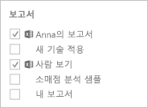

# 자습서:  Power BI 조직 콘텐츠 팩 만들기 및 게시

이 자습서에서는 조직 콘텐츠 팩을 만들고, 특정 그룹에 액세스 권한을 부여하며, Power BI에서 조직의 콘텐츠 팩 라이브러리에 게시합니다.

콘텐츠 팩을 만드는 것은 대시보드를 공유하거나 그룹 내에서 공동 작업하는 것과 다릅니다. [PowerBI에서 작업을 공유하는 방법](service-how-to-collaborate-distribute-dashboards-reports.md)을 읽고, 상황에 가장 적합한 옵션을 결정합니다.

조직 콘텐츠 팩을 만들려면 귀하와 귀하의 동료를 위한 [Power BI Pro 계정](https://powerbi.microsoft.com/pricing)이 필요합니다.

> [!NOTE]
> 새 작업 영역 환경에서 조직 콘텐츠 팩을 만들거나 설치할 수 없습니다. 아직 시작하지 않은 경우, 이제 콘텐츠 팩을 앱으로 업그레이드하세요. [새 작업 영역 환경에 대해 자세히](service-create-the-new-workspaces.md) 알아봅니다.

## 콘텐츠 팩 만들기 및 게시

Contoso의 릴리스 관리자이고 신제품 출시를 준비하는 중이라고 가정해 보겠습니다.  공유하려는 보고서가 포함된 대시보드를 만들었습니다. 출시를 관리하는 다른 직원에게 유용할 수 있습니다. 사용할 동료를 위한 솔루션으로 대시보드 및 보고서를 패키징하는 방법을 원합니다.

함께 진행해볼까요? [Power BI 서비스](https://powerbi.com)에서 **내 작업 영역**으로 이동합니다. 그런 다음, **데이터 가져오기** > **샘플** > **기회 분석 샘플** > **연결**로 이동하여 고유한 복사본을 가져옵니다.

1. 탐색 창에서 **작업 영역** > **내 작업 영역**을 선택합니다.

1.  위쪽 탐색 창에서 톱니바퀴 아이콘  > **콘텐츠 팩 만들기**를 선택합니다.

   

1. **콘텐츠 팩 만들기** 창에서 다음 정보를 입력합니다.  

   조직의 콘텐츠 팩 라이브러리는 빠르게 채워질 수 있습니다. 조직 또는 그룹을 위해 게시된 콘텐츠 팩이 라이브러리에 수백 개 포함될 수 있습니다. 시간을 할애하여 콘텐츠 팩에 의미 있는 이름을 지정하고, 적절한 설명을 추가하고, 올바른 대상 그룹을 선택합니다.  검색을 통해 콘텐츠 팩을 찾기 쉬운 단어를 사용합니다. 이렇게 하면 나중에 쉽게 찾을 수 있습니다.

      

    1. **특정 그룹**을 선택합니다.

    1. 개인, [Office 365 그룹](https://support.office.com/article/Create-a-group-in-Office-365-7124dc4c-1de9-40d4-b096-e8add19209e9), 메일 그룹 또는 보안 그룹의 전체 메일 주소를 입력합니다. 예: salesmgrs@contoso.com; sales@contoso.com

        이 자습서에서는 그룹의 메일 주소를 사용하겠습니다.

    1. 콘텐츠 팩 이름을 *영업 기회*로 지정합니다.

        > [!TIP]
        > 콘텐츠 팩의 이름에 대시보드 이름을 포함하는 것이 좋습니다. 그러면 동료가 콘텐츠 팩에 연결한 후 대시보드를 더욱 쉽게 찾을 수 있습니다.

    1. 권장: 설명을 추가합니다. 그러면 동료가 필요한 콘텐츠 팩을 더욱 쉽게 찾을 수 있습니다. 설명 외에도 동료들이 이 콘텐츠 팩을 검색하는 데 사용할 수 있는 키워드를 추가합니다. 동료가 질문이 있거나 도움이 필요한 경우 연락할 수 있는 연락처 정보를 포함합니다.

    1. 이미지 또는 로고를 업로드하여 그룹 구성원이 콘텐츠 팩을 더욱 쉽게 찾을 수 있도록 합니다.

        텍스트를 검색하는 것보다 이미지를 검색하는 것이 더 빠릅니다. 스크린샷은 **기회 수** 세로 막대형 차트 타일의 이미지를 보여 줍니다.

    1. **기회 분석 샘플** 대시보드를 선택하고 콘텐츠 팩에 추가합니다.

        Power BI는 관련된 보고서 및 데이터 세트를 자동으로 추가합니다. 원하는 경우 다른 항목을 추가할 수 있습니다.

       > [!NOTE]
       > Power BI는 편집할 수 있는 대시보드, 보고서, 데이터 세트 및 통합 문서만 나열합니다. 따라서 사용자와 공유된 항목은 앱에 표시되지 않습니다.

   1. Excel 통합 문서가 있는 경우 **보고서** 아래에 Excel 아이콘과 함께 표시됩니다. 콘텐츠 팩에도 추가할 수 있습니다.

      

      > [!NOTE]
      > 그룹 구성원이 Excel 통합 문서를 볼 수 없는 경우 [비즈니스용 OneDrive에서 통합 문서를 공유](https://support.office.com/article/Share-documents-or-folders-in-Office-365-1fe37332-0f9a-4719-970e-d2578da4941c)해야 할 수 있습니다.

1. **게시**를 선택하여 콘텐츠 팩을 그룹의 조직 콘텐츠 팩 라이브러리에 추가합니다.  

   성공적으로 게시되면 성공 메시지가 표시됩니다.

1. 그룹 구성원이 **데이터 가져오기** > **조직 콘텐츠 팩**으로 이동하면 해당 콘텐츠 팩이 표시됩니다.

   

   > [!TIP]
   > 브라우저에 표시되는 URL은 이 콘텐츠 팩의 고유 주소입니다.  동료에게 이 새 콘텐츠 팩에 대해 알리시겠습니까?  전자 메일에 URL을 붙여넣습니다.

1. 그룹 구성원이 **연결**을 선택하면 [콘텐츠 팩을 보고 작업](service-organizational-content-pack-copy-refresh-access.md)할 수 있습니다.

## 다음 단계

* [Power BI의 조직 콘텐츠 팩 소개](service-organizational-content-pack-introduction.md)

* [조직 콘텐츠 팩 관리, 업데이트 및 삭제](service-organizational-content-pack-manage-update-delete.md)

* [Power BI에 앱 게시](service-create-distribute-apps.md)

* [비즈니스용 OneDrive란?](https://support.office.com/article/What-is-OneDrive-for-Business-187f90af-056f-47c0-9656-cc0ddca7fdc2)

* 궁금한 점이 더 있나요? [Power BI 커뮤니티를 이용하세요.](https://community.powerbi.com/)
