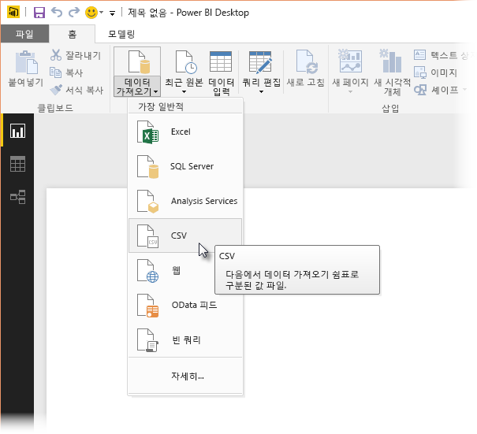
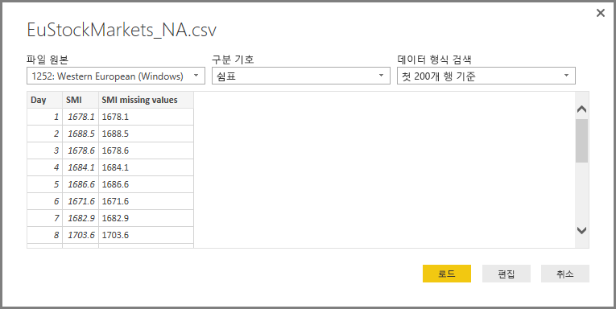
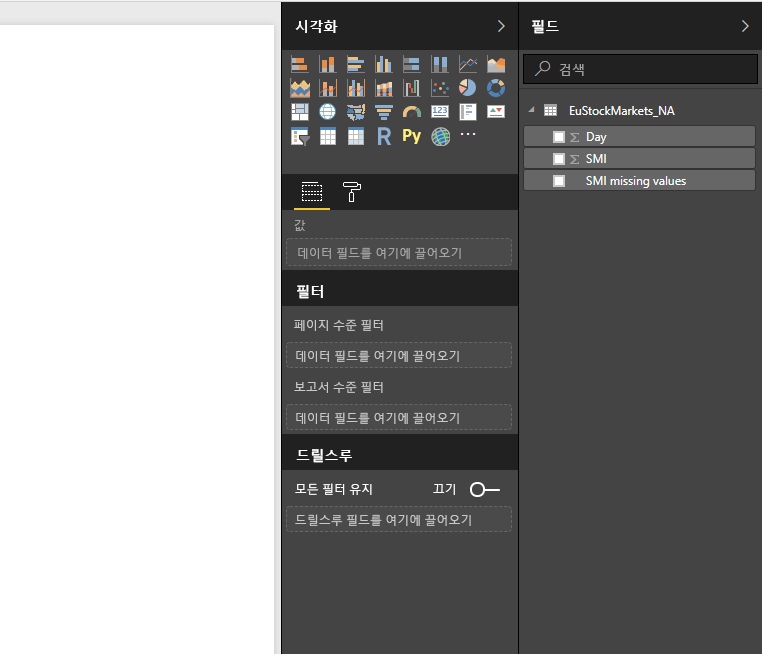
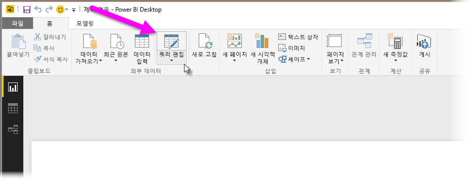
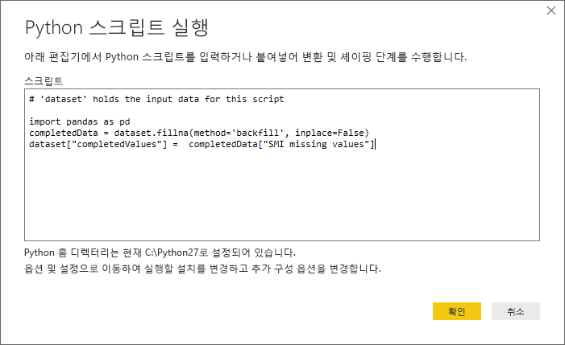
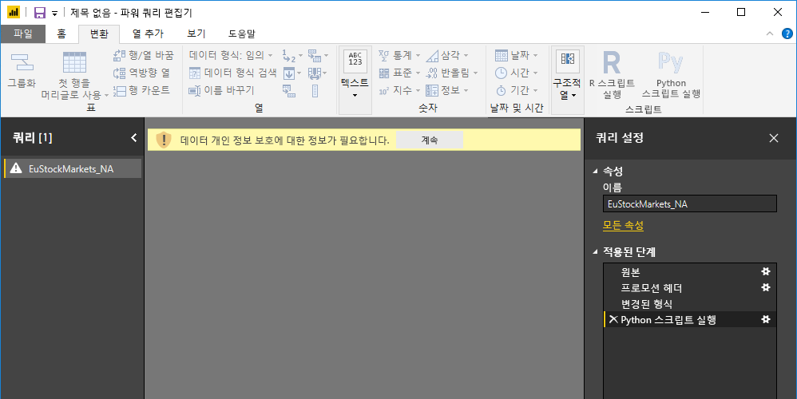
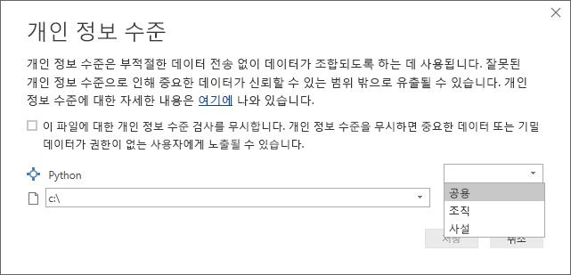
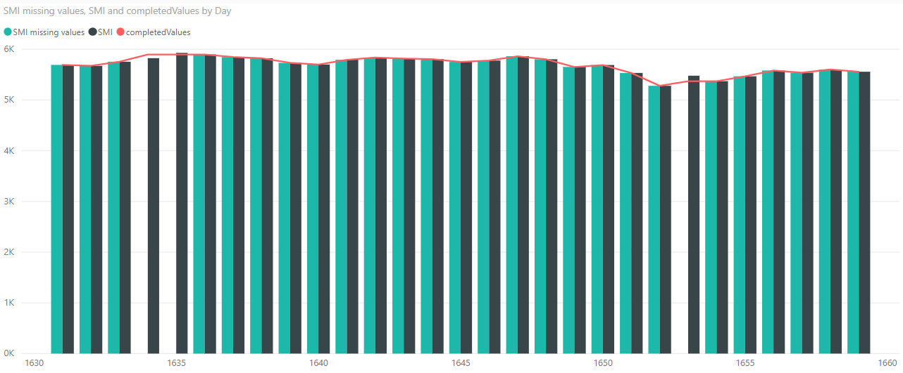
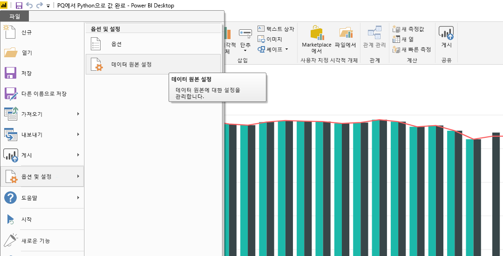

# <a name="use-python-in-query-editor"></a>쿼리 편집기에서 Python 사용
Power BI Desktop **쿼리 편집기**에서 통계학자, 데이터 과학자 및 데이터 분석에 의해 널리 사용되는 프로그래밍 언어인 **Python**을 사용할 수 있습니다. Python을 **쿼리 편집기**에 통합하면 Python을 사용하여 데이터 정리를 수행하고 누락된 데이터, 예측, 클러스터링을 완성하는 작업을 포함하여 데이터 세트에서 고급 데이터 셰이핑 및 분석을 수행할 수 있습니다. **Python**은 강력한 언어이며 **쿼리 편집기**에서 데이터 모델을 준비하고 보고서를 만드는 데 사용될 수 있습니다.

## <a name="installing-python"></a>Python 설치
Power BI Desktop의 **쿼리 편집기**에서 **Python**을 사용하려면 로컬 머신에 **Python**을 설치해야 합니다. [공식 Python 다운로드 페이지](https://www.python.org/) 및 [Anaconda](https://anaconda.org/anaconda/python/)를 비롯한 여러 위치에서 무료로 **Python**을 다운로드 및 설치할 수 있습니다.

## <a name="using-python-in-query-editor"></a>쿼리 편집기에서 Python 사용
**쿼리 편집기**에서 **Python**을 사용하는 방법을 보여 주려면 .CSV 파일 형식의 주식 시장 데이터 세트 예제를 가져오세요. [여기에서 다운로드](https://download.microsoft.com/download/F/8/A/F8AA9DC9-8545-4AAE-9305-27AD1D01DC03/EuStockMarkets_NA.csv)하여 진행할 수 있습니다. 이 예제에 대한 단계는 다음과 같습니다.

1. 먼저 데이터를 **Power BI Desktop**으로 로드합니다. 이 예제에서는 *EuStockMarkets_NA.csv* 파일을 로드하고, **Power BI Desktop**의 **홈** 리본에서 **데이터 가져오기 > CSV**를 선택합니다.
   
   
2. 파일을 선택하고 **열기**를 선택하면 CSV는 **CSV 파일** 대화 상자에 표시됩니다.
   
   
3. 데이터가 로드되면 Power BI Desktop의 **필드** 창에 표시됩니다.
   
   
4. **Power BI Desktop**의 **홈** 탭에서 **쿼리 편집**을 선택하여 **쿼리 편집기**를 엽니다.
   
   
5. **변환** 탭에서 **Python 스크립트 실행**을 선택하면 **Python 스크립트 실행** 편집기가 나타납니다(다음 단계에 표시됨). 다음 이미지에서 볼 수 없는 다른 행과 마찬가지로 15, 20행은 누락된 데이터가 발생합니다. 아래 단계는 Python이 해당 행을 완성하는 방법을 보여 줍니다.
   
   
6. 이 예제에서는 다음 스크립트 코드를 입력합니다.
   
    ```python
       import pandas as pd
       completedData = dataset.fillna(method='backfill', inplace=False)
       dataset["completedValues"] =  completedData["SMI missing values"]
   ```

   > [!NOTE]
   > 이전의 스크립트 코드가 제대로 작동하려면 Python 환경에 *pandas* 라이브러리가 설치되어 있어야 합니다. pandas를 설치하려면 Python 설치에서 다음 명령을 실행합니다. |      > pip install pandas
   > 
   > 
   
   **Python 스크립트 실행** 대화 상자에 삽입했을 때 코드는 다음과 같이 표시됩니다.
   
   
7. **확인**을 선택하면 **쿼리 편집기**에서 데이터 개인 정보 보호에 대한 경고를 표시합니다.
   
   
8. Python 스크립트가 Power BI 서비스에서 제대로 작동하려면 모든 데이터 원본이 ‘공용’으로 설정되어야 합니다.  개인 정보 설정 및 해당 구현에 대한 자세한 내용은 [개인 정보 수준](../admin/desktop-privacy-levels.md)을 참조하세요.
   
   
   
   **필드** 창에서 *completedValues*라는 새 열을 확인할 수 있습니다. 행 15, 18에서와 같은 몇 가지 누락된 데이터 요소가 있습니다. 다음 섹션에서는 Python이 이를 처리하는 방법을 살펴봅니다.
   

**쿼리 편집기**는 Python 스크립트 다섯 줄만 사용하여 예측 모델로 누락된 값을 입력했습니다.

## <a name="creating-visuals-from-python-script-data"></a>Python 스크립트 데이터를 통해 시각적 개체 만들기
이제 시각적 개체를 만들어 다음 이미지에 보이는 것처럼 *pandas* 라이브러리를 사용하는 Python 스크립트 코드가 누락된 값을 완성하는 방법을 확인할 수 있습니다.



해당 시각적 개체 또는 **Power BI Desktop**을 사용하여 만들려는 다른 시각적 개체가 완성되면 **Power BI Desktop** 파일을 저장(.pbix 파일로 저장)한 다음, Power BI 서비스에서 해당 파일의 일부인 Python 스크립트를 포함하여 데이터 모델을 사용할 수 있습니다.

> [!NOTE]
> 이러한 단계를 완료한 .pbix 파일을 보시겠습니까? 간단한 방법이 있습니다. 이 예제에서 사용한 완료된 **Power BI Desktop** 파일을 [지금 바로](https://download.microsoft.com/download/A/B/C/ABCF5589-B88F-49D4-ADEB-4A623589FC09/Complete%20Values%20with%20Python%20in%20PQ.pbix) 다운로드할 수 있습니다.

.pbix 파일을 Power BI 서비스에 업로드했으면 (서비스에서) 데이터 새로 고침을 사용하도록 설정하고 서비스에서 시각적 개체가 업데이트될 수 있도록 하기 위해 몇 가지 추가 단계를 수행해야 합니다(시각적 개체가 업데이트되려면 데이터가 Python에 액세스해야 함). 추가 단계는 다음과 같습니다.

* **데이터 세트에 대해 예약된 새로 고침 사용** - Python 스크립트를 통해 데이터 세트를 포함하는 통합 문서에 대해 예약된 새로 고침을 사용하려면 [예약된 새로 고침 구성](refresh-scheduled-refresh.md)을 참조하세요. 여기에는 **개인 게이트웨이**에 대한 정보도 포함되어 있습니다.
* **개인 게이트웨이 설치** - 파일이 위치하고 Python이 설치되어 있는 머신에 **개인 게이트웨이**를 설치해야 합니다. Power BI 서비스는 해당 통합 문서에 액세스하고 업데이트된 시각적 개체를 다시 렌더링해야 합니다. [개인 게이트웨이를 설치하고 구성](service-gateway-personal-mode.md)하는 방법에 대한 자세한 정보를 얻을 수 있습니다.

## <a name="limitations"></a>제한 사항
**쿼리 편집기**에서 만든 Python 스크립트를 포함하는 쿼리에는 몇 가지 제한 사항이 있습니다.

* 모든 Python 데이터 원본은 ‘공용’으로 설정되어야 하고 **쿼리 편집기**에서 만든 쿼리의 다른 모든 단계도 공용이어야 합니다.  데이터 원본 설정으로 이동하려면 **Power BI Desktop**에서 **파일 > 옵션 및 설정 > 데이터 원본 설정**을 선택합니다.
  
  
  
  **데이터 원본 설정** 대화 상자에서는 데이터 원본을 선택한 다음, **사용 권한 편집...** 을 선택하고 **개인 정보 수준**이 *공용*으로 설정되었는지 확인합니다.
  
      
* Python 시각적 개체 또는 데이터 세트의 예약된 새로 고침을 사용하려면 **예약된 새로 고침**을 사용하도록 설정하고 통합 문서 및 Python 설치가 있는 컴퓨터에 **개인 게이트웨이**를 설치해야 합니다. 둘 다에 대한 자세한 내용은 이 문서의 이전 섹션을 참조하며 여기서 각각에 대한 자세한 내용을 알아보는 링크를 제공합니다.
* 중첩 테이블(테이블의 테이블)은 현재 지원되지 않습니다. 

Python 및 사용자 지정 쿼리를 사용하여 모든 종류의 작업을 수행할 수 있으므로 데이터를 탐색하고 표시하려는 방식으로 모양을 지정합니다.
