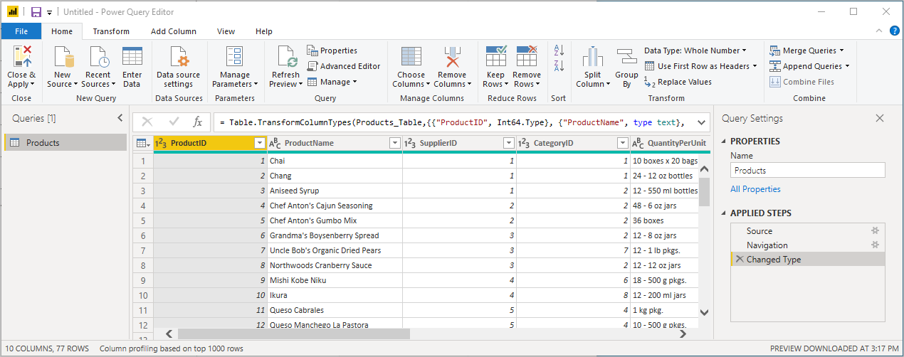
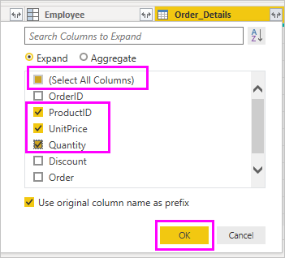
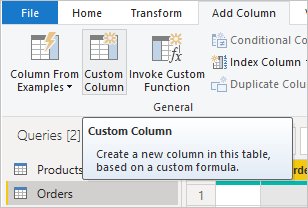
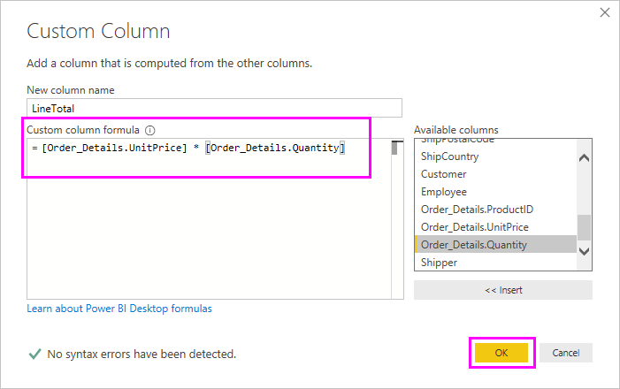
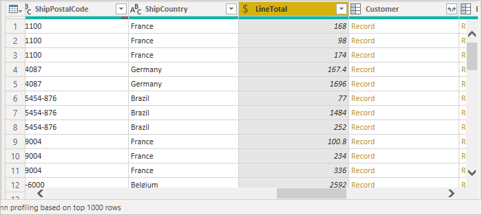
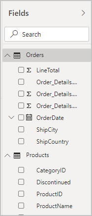
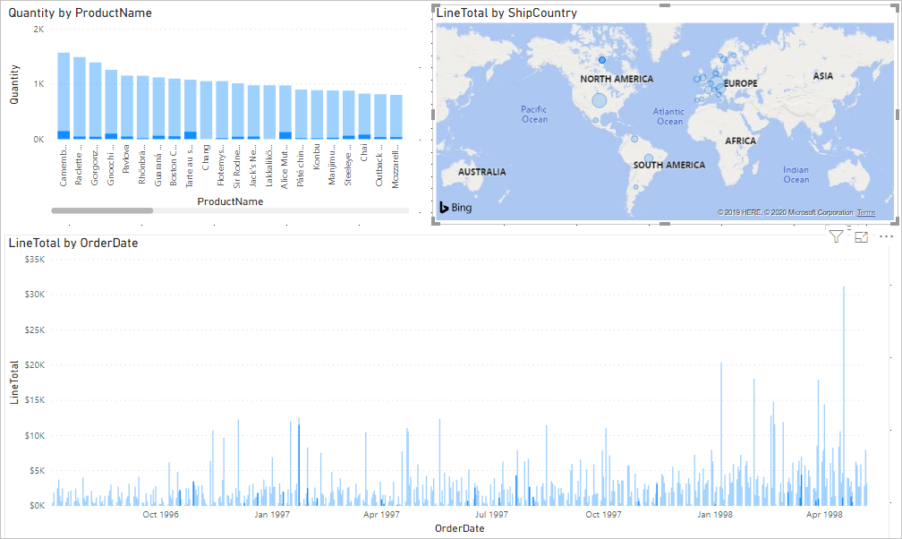

# 자습서:  Excel 및 OData 피드의 판매 데이터 분석

데이터를 여러 데이터 원본에 두는 것은 일반적입니다. 예를 들어 두 가지 데이터베이스를 하나는 제품 정보용으로, 나머지는 판매 정보용으로 사용할 수 있습니다. *Power BI Desktop*을 사용하면 서로 다른 원본의 데이터를 결합하여 흥미롭고 매력적인 데이터 분석 및 시각화를 만들 수 있습니다.

이 자습서에서는 두 가지 데이터 원본의 데이터를 결합합니다.

* 제품 정보가 포함된 Excel 통합 문서
* 주문 데이터가 포함된 OData 피드

각 데이터 세트를 가져와서 변환 및 집계 작업을 수행하려고 합니다. 그런 다음, 두 원본의 데이터를 사용하여 대화형 시각화가 포함된 판매 분석 보고서를 작성합니다. 이러한 기법은 나중에 SQL Server 쿼리, CSV 파일 및 Power BI Desktop의 기타 데이터 원본에 적용할 수 있습니다.

>[!NOTE]
>Power BI Desktop에는 일반적으로 작업을 수행하는 몇 가지 방법이 있습니다. 예를 들어 열이나 셀에서 마우스 오른쪽 단추를 클릭하거나 **기타 옵션** 메뉴를 사용하여 추가 리본 선택 항목을 볼 수 있습니다. 몇 가지 대체 방법은 아래 단계에 설명되어 있습니다.

## Excel 제품 데이터 가져오기

먼저 *Products.xlsx* Excel 통합 문서에서 Power BI Desktop으로 제품 데이터를 가져옵니다.

1. [Products.xlsx Excel 통합 문서를 다운로드](https://download.microsoft.com/download/1/4/E/14EDED28-6C58-4055-A65C-23B4DA81C4DE/Products.xlsx)하여 *Products.xlsx*로 저장합니다.

1. Power BI Desktop 리본의 **홈** 탭에서 **데이터 가져오기** 옆에 있는 화살표를 선택한 다음, **가장 일반적** 메뉴에서 **Excel**을 선택합니다.

   

   >[!NOTE]
   >**데이터 가져오기** 항목 자체를 선택하거나 Power BI **시작** 대화 상자에서 **데이터 가져오기**를 선택한 다음, **데이터 가져오기** 대화 상자에서 **Excel** 또는 **파일** > **Excel**을 선택하고 **연결**을 선택할 수도 있습니다.

1. **열기** 대화 상자에서 **Products.xlsx** 파일로 이동하여 파일을 선택한 다음, **열기**를 선택합니다.

1. **탐색기**에서 **Products** 테이블을 선택한 다음 **데이터 변환**을 선택합니다.

   

테이블의 미리 보기가 Power Query 편집기에서 열리고, 여기에서 변환을 적용하여 데이터를 정리할 수 있습니다.

>[!NOTE]
>Power BI Desktop의 리본 메뉴 **홈** 리본에서 **쿼리 편집** > **쿼리 편집**을 선택하거나, **보고서** 보기에서 쿼리 옆에 있는 **추가 옵션**을 마우스 오른쪽 단추로 클릭하거나 선택하고 **쿼리 편집**을 선택하여 Power Query 편집기를 열 수도 있습니다.

## 제품 열 정리

결합된 보고서는 Excel 통합 문서의 **ProductID**, **ProductName**, **QuantityPerUnit** 및 **UnitsInStock** 열을 사용합니다. 다른 열은 제거할 수 있습니다.

1. Power Query 편집기에서 **ProductID**, **ProductName**, **QuantityPerUnit**, **UnitsInStock**열을 선택합니다. Ctrl 키를 사용하여 둘 이상의 열을 선택하거나 Shift 키를 사용하여 서로 옆에 있는 열을 선택합니다.

1. 선택한 머리글 중 하나를 마우스 오른쪽 단추로 클릭합니다. 드롭다운 메뉴에서 **다른 열 제거**를 선택합니다.
   **홈** 리본 탭의 **열 관리** 그룹에서 **열 제거** > **다른 열 제거**를 선택할 수도 있습니다.

   

## OData 피드의 주문 데이터 가져오기

그런 다음, 샘플 Northwind 판매 시스템 OData 피드에서 주문 데이터를 가져옵니다.

1. Power Query 편집기에서 **새 원본**을 선택한 다음, **가장 일반적** 메뉴에서 **OData 피드**를 선택합니다.

   

1. **OData 피드** 대화 상자에서 Northwind OData 피드의 URL인 `https://services.odata.org/V3/Northwind/Northwind.svc/`를 붙여넣습니다. **확인**을 선택합니다.

   

1. **탐색기**에서 **Orders** 테이블을 선택한 다음, **Transform Data**를 선택하여 데이터를 Power Query 편집기로 로드합니다.

   

   >[!NOTE]
   >**탐색기**에서 확인란을 선택하지 않고 테이블 이름을 선택하여 미리 보기를 표시할 수 있습니다.

## 주문 데이터 확장

관계형 데이터베이스 또는 Northwind OData 피드와 같은 여러 테이블이 있는 데이터 원본에 연결할 때 테이블 참조를 사용하여 쿼리를 빌드할 수 있습니다. **Orders** 테이블에는 여러 관련 테이블에 대한 참조가 있습니다. 확장 작업을 사용하여 관련 **Order_Details** 테이블의 **ProductID**, **UnitPrice**, **Quantity** 열을 제목(**Orders**) 테이블에 추가할 수 있습니다.

1. **Order_Details** 열이 보일 때까지 **Orders** 테이블에서 오른쪽으로 스크롤합니다. 여기에는 데이터가 아닌 다른 테이블에 대한 참조가 포함되어 있습니다.

   

1. **Order_Details** 열 머리글에서 **확장** 아이콘()을 선택합니다.

1. 드롭다운 메뉴에서 다음을 수행합니다.

   1. **(모든 열 선택)** 을 선택하여 모든 열을 선택 취소합니다.

   1. **ProductID**, **UnitPrice** 및 **Quantity**를 선택한 다음, **확인**을 선택합니다.

      

**Order_Details** 테이블을 확장하면 새 중첩 테이블 열 3개가 **Order_Details** 열을 대체합니다. 테이블에 각 주문의 추가 데이터에 대한 새로운 행이 있습니다.

## 사용자 지정 계산 열 만들기

파워 쿼리 편집기를 사용하면 계산 및 사용자 지정 필드를 만들어 데이터를 보강할 수 있습니다. 단가에 항목 수량을 곱하여 각 주문의 품목에 대한 총 가격을 계산하는 사용자 지정 열을 만듭니다.

1. 파워 쿼리 편집기의 **열 추가** 리본 탭에서 **사용자 지정 열**을 선택합니다.

   

1. **사용자 지정 열** 대화 상자의 **새 열 이름** 필드에 **LineTotal**을 입력합니다.

1. **사용자 지정 열 수식** 필드에서 **=** 다음에 **[Order_Details.UnitPrice]** \* **[Order_Details.Quantity]** 를 입력합니다. **사용할 수 있는 열** 스크롤 상자에서 필드 이름을 선택하고 입력하는 대신 **<< 삽입**을 선택할 수도 있습니다.

1. **확인**을 선택합니다.

   

   새 **LineTotal** 필드가 **Orders** 테이블의 마지막 열로 나타납니다.

## 새 필드의 데이터 형식 설정

파워 쿼리 편집기가 데이터에 연결되면, 표시 목적으로 각 필드의 데이터 형식을 최대한 추측합니다. 머리글 아이콘은 각 필드의 할당된 데이터 형식을 나타냅니다. **홈** 리본 탭의 **변환** 그룹에서 **데이터 형식**을 볼 수도 있습니다.

새 **LineTotal** 열은 **임의** 데이터 형식이지만 통화 값이 있습니다. 데이터 형식을 할당하려면 **LineTotal** 열 머리글을 마우스 오른쪽 단추로 클릭하고, 드롭다운 메뉴에서 **형식 변경**을 선택한 다음, **고정 10진수**를 선택합니다.

>[!NOTE]
>**LineTotal** 열을 선택한 다음, **홈** 리본 탭의 **변환** 영역에서 **데이터 형식** 옆에 있는 화살표를 선택하고, **고정 10진수**를 선택할 수도 있습니다.

## 주문 열 정리

보고서에서 모델을 더 쉽게 사용할 수 있도록 일부 열을 삭제하고, 이름을 바꾸고, 다시 정렬할 수 있습니다.

보고서에 다음 열이 사용됩니다.

* **OrderDate**
* **ShipCity**
* **ShipCountry**
* **Order_Details.ProductID**
* **Order_Details.UnitPrice**
* **Order_Details.Quantity**
* **LineTotal**

이러한 열을 선택하고 Excel 데이터와 마찬가지로 **다른 열 제거**를 사용합니다. 또는 목록에 없는 열을 선택하고 그 중 하나를 마우스 오른쪽 단추로 클릭한 다음, **열 제거**를 선택해도 됩니다.

"**Order_Details.** " 접두사가 지정된 열의 이름을 바꿔서 읽기 쉽도록 만들 수 있습니다.

1. 각 열 머리글을 두 번 클릭하거나 길게 누르거나, 열 머리글을 마우스 오른쪽 단추로 클릭하고 드롭다운 메뉴에서 **이름 바꾸기**를 선택합니다.

1. 각 이름에서 **Order_Details.** 를 각 이름의 접두사입니다.

마지막으로 **LineTotal** 열에 더 쉽게 액세스할 수 있도록 열을 왼쪽으로 끌어서 **ShipCountry** 열의 바로 오른쪽에 놓습니다.

## 쿼리 단계 검토

데이터 모양을 지정하고 변환하는 파워 쿼리 편집기 작업이 기록됩니다. 각 작업은 **적용된 단계**의 **쿼리 설정** 창 오른쪽에 나타납니다. **적용된 단계**를 뒤로 돌려서, 단계를 검토하고 필요한 경우 편집, 삭제 또는 다시 정렬할 수 있습니다. 단, 이전 단계를 변경하면 이후 단계에 지장을 줄 수 있으므로 위험합니다.

파워 쿼리 편집기의 왼쪽에 있는 **쿼리** 목록에서 각 쿼리를 선택하고 **쿼리 설정**에서 **적용된 단계**를 검토합니다. 이전 데이터 변환을 적용한 후 두 쿼리에 대한 **적용된 단계**는 다음과 같아야 합니다.

 &nbsp;&nbsp; 

>[!TIP]
>적용된 단계의 기초는 [M](https://docs.microsoft.com/powerquery-m/power-query-m-reference) 언어라고도 하는 *파워 쿼리 언어*로 작성된 수식입니다. 수식을 보고 편집하려면 리본 메뉴의 **홈** 탭에 있는 **쿼리** 그룹에서 **고급 편집기**를 선택합니다.

## 변환된 데이터 가져오기

변환된 데이터가 만족스럽고 Power BI Desktop **보고서** 보기로 가져올 준비가 되면 **홈** 리본 탭의 **닫기** 그룹에서 **닫기 및 적용** > **닫기 및 적용**을 선택합니다.

데이터가 로드되면 Power BI Desktop **보고서** 보기의 **필드** 목록에 쿼리가 나타납니다.

## 데이터 세트 간의 관계 관리

Power BI Desktop에서는 쿼리를 결합하여 보고할 필요가 없습니다. 하지만 공통 필드를 기반으로 데이터 세트 간의 관계를 사용하여 보고서를 확장하고 보강할 수 있습니다. Power BI Desktop에서 관계를 자동으로 검색하거나, 사용자가 Power BI Desktop **관계 관리** 대화 상자에서 관계를 만들 수 있습니다. 자세한 내용은 [Power BI Desktop에서 관계 만들기 및 관리](../transform-model/desktop-create-and-manage-relationships.md)를 참조하세요.

공유 `ProductID` 필드는 이 자습서의 `Orders` 및 `Products` 데이터 세트 간에 관계를 만듭니다.

1. Power BI Desktop **보고서** 보기에서 **홈** 리본 탭의 **관계** 영역에 있는 **관계 관리**를 선택합니다.

   

1. **관계 관리** 대화 상자에서 Power BI Desktop이 **Products**와 **Orders** 테이블 간의 활성 관계를 이미 검색하여 나열한 것을 볼 수 있습니다. 관계를 보려면 **편집**을 선택합니다.

   

   관계에 대한 세부 정보를 표시하는 **관계 편집**이 열립니다.  

   

1. Power BI Desktop이 관계를 올바르게 자동 검색했으므로 **취소**, **닫기**를 차례로 선택할 수 있습니다.

Power BI Desktop의 왼쪽에서 **모델**을 선택하여 쿼리 관계를 보고 관리합니다. 두 개의 쿼리를 연결하는 선에서 화살표를 두 번 클릭하여 **관계 편집** 대화 상자를 열고 관계를 보거나 변경합니다.

**모델** 보기에서 **보고서** 보기로 돌아가려면 **보고서** 아이콘을 선택합니다.

## 데이터를 사용하여 시각화 만들기

Power BI Desktop 검토 보기에서 데이터 인사이트를 얻을 수 있는 다양한 시각화를 만들 수 있습니다. 보고서에는 여러 페이지가 있을 수 있고, 각 페이지에 여러 시각적 개체가 포함될 수 있습니다. 나와 다른 사람이 시각화를 조작하면서 데이터를 분석하고 이해할 수 있습니다. 자세한 내용은 [Power BI 서비스의 편집 보기에서 보고서와 상호 작용](../create-reports/service-interact-with-a-report-in-editing-view.md)을 참조하세요.

데이터 집합 및 데이터 집합 간의 관계를 둘 다 사용하여 판매 데이터를 시각화하고 분석할 수 있습니다.

먼저 두 쿼리의 필드를 사용하여 주문한 각 제품의 수량을 표시하는 누적 세로 막대형 차트를 만듭니다.

1. 오른쪽의 **필드** 창에 있는 **Orders**에서 **Qunatity** 필드를 선택하거나 캔버스의 빈 공간으로 끌어옵니다. 주문한 모든 제품의 총 수량을 표시하는 누적 세로 막대형 차트가 만들어집니다.

1. 주문한 각 제품의 수량을 표시하려면, **필드** 창의 **Products**에서 **ProductName**을 선택하거나 차트로 끌어 옵니다.

1. 주문이 가장 많은 제품에서 적은 제품 순서로 정렬하려면 시각화의 오른쪽 위에 있는 **추가 옵션** 줄임표( **...** )를 선택한 다음, **수량별 정렬**을 선택합니다.

1. 차트의 모서리에 있는 핸들을 사용하여 더 많은 제품 이름이 표시되도록 차트를 확대합니다.

   

다음으로는 시간(**OrderDate**)에 따라 주문 금액(**LineTotal**)을 보여주는 차트를 만듭니다.

1. 캔버스에서 아무것도 선택하지 않은 상태로 **필드** 창의 **Orders**에서 **LineTotal**을 선택하거나 캔버스의 빈 공간으로 끌어옵니다. 누적 세로 막대형 차트에 모든 주문의 총 금액이 표시됩니다.

1. 누적 차트를 선택한 다음, **Orders**에서 **OrderDate**를 선택하거나 차트로 끌어옵니다. 이제 차트에 각 주문 날짜의 라인 합계가 표시됩니다.

1. 모서리를 끌어서 시각화의 크기를 조정하면 더 많은 데이터를 볼 수 있습니다.

   

   >[!TIP]
   >차트에서 **연도**만(세 개의 데이터 요소만) 보이면 **시각화** 창의 **축** 필드에서 **OrderDate** 옆의 화살표를 선택하고 **날짜 계층** 대신 **OrderDate**를 선택합니다.

마지막으로 각 국가의 주문 금액을 표시하는 맵 시각화를 만듭니다.

1. 캔버스에서 아무것도 선택하지 않은 상태로 **필드** 창의 **Orders**에서 **ShipCountry**를 선택하거나 캔버스의 빈 공간으로 끌어옵니다. 데이터가 국가 이름인 것이 Power BI Desktop에서 검색됩니다. 그런 다음, 주문이 있는 각 국가의 데이터 요소가 있는 지도 시각화가 자동으로 만들어집니다.

1. 데이터 요소 크기에 각 국가의 주문 금액을 반영하려면 **LineTotal** 필드를 지도로 끌어옵니다. **시각화** 창의 **크기** 아래 **여기에 데이터 필드 추가**로 끌어올 수도 있습니다. 이제 맵에 있는 원 크기에 각 국가의 주문 금액이 반영됩니다.

   

## 추가 분석을 위해 보고서 시각적 개체 조작

Power BI Desktop에서 상호 강조 표시하고 서로를 필터링하여 추가 추세를 표시하는 시각적 개체를 조작할 수 있습니다. 자세한 내용은 [Power BI 보고서에서 필터 및 강조 표시](../create-reports/power-bi-reports-filters-and-highlighting.md)를 참조하세요.

쿼리 간의 관계로 인해 하나의 시각화 조작은 페이지의 다른 모든 시각화에 영향을 줍니다.

맵 시각화에서 **캐나다** 가운데에 있는 원을 선택합니다. 다른 두 개의 시각화는 캐나다의 라인 합계 및 주문 수량을 강조 표시하도록 필터링됩니다.

**ProductName별 수량** 차트 제품을 선택하여 해당 제품의 데이터를 반영하는 지도 및 날짜 차트 필터를 확인합니다. **OrderDate별 LineTotal** 차트 데이터를 선택하여 해당 날짜의 데이터를 표시하는 지도 및 제품 차트 필터를 봅니다.

>[!TIP]
>선택을 취소하려면 다시 선택하거나 다른 시각화 중 하나를 선택합니다.

## 판매 분석 보고서 완료

완료된 보고서는 서로 다른 국가의 주문 정보, 시간대 및 제품을 분석하는 데 도움이 되는 시각적 개체의 Northwind OData 피드 및 *Products.xlsx Excel* 파일의 데이터를 결합합니다. 보고서가 준비되면 [Power BI 서비스에 업로드](../create-reports/desktop-upload-desktop-files.md)하여 다른 Power BI 사용자와 공유할 수 있습니다.

## 다음 단계

* [다른 Power BI Desktop 자습서 참고](/power-bi/guided-learning/)
* [Power BI Desktop 동영상 시청](/power-bi/desktop-videos)
* [Power BI 포럼 방문](https://go.microsoft.com/fwlink/?LinkID=519326)
* [Power BI 블로그 참고](https://go.microsoft.com/fwlink/?LinkID=519327)
