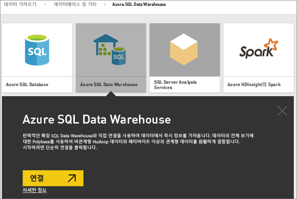
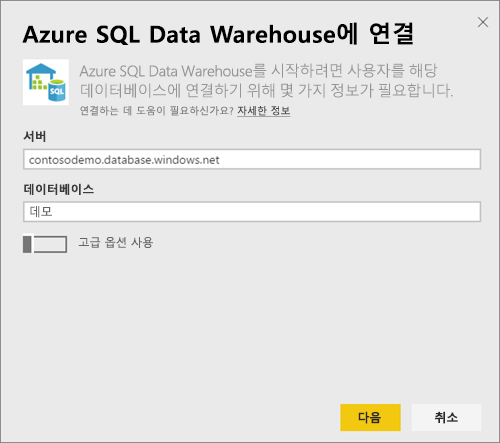
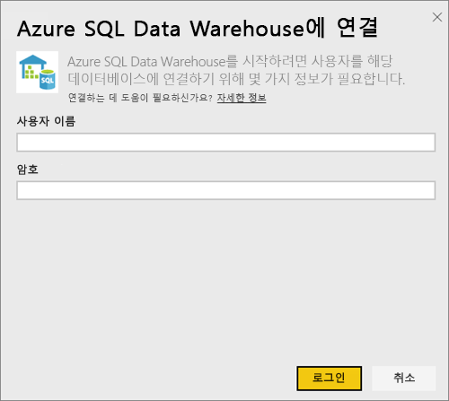
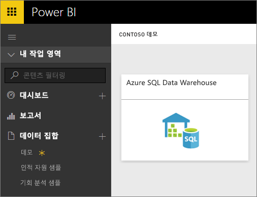
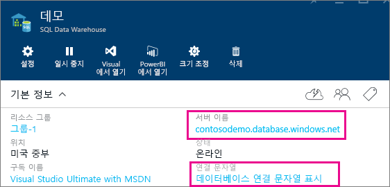

# DirectQuery를 사용한 Azure SQL Data Warehouse

DirectQuery을 사용한 Azure SQL Data Warehouse를 통해 Azure SQL Data Warehouse에 이미 있는 데이터와 메트릭을 기반으로 하는 동적 보고서를 만들 수 있습니다. DirectQuery을 사용할 경우 데이터를 탐색할 때 쿼리가 Azure SQL Data Warehouse로 다시 전송됩니다. 실시간 쿼리가 SQL Data Warehouse의 규모와 결합하여 테라바이트의 데이터를 상대로 몇 분 안에 동적 보고서를 만들 수 있습니다. 또한 **Power BI에서 열기** 버튼이 있어 사용자가 수동으로 정보를 지정하지 않고도 직접 Power BI를 SQL Data Warehouse에 연결할 수 있습니다.

SQL Data Warehouse 커넥터를 사용할 때

* 연결 시 정규화된 서버 이름을 지정합니다.(자세한 내용은 아래 참조)
* 서버에 대한 방화벽 규칙이 "Azure 서비스에 대한 액세스 허용"으로 구성되었는지 확인합니다.
* 열 선택 또는 필터 추가와 같은 모든 작업은 직접 데이터 웨어하우스에 쿼리합니다.
* 타일은 약 15분마다 새로 고쳐지도록 설정되며 새로 고침을 예약할 필요가 없습니다.  새로 고침은 연결할 때 고급 설정에서 조정할 수 있습니다.
* DirectQuery 데이터 세트에 대해 질문 및 답변을 사용할 수 없습니다.
* 스키마 변경 내용은 자동으로 선택되지 않습니다.

이러한 제한 사항 및 참고는 환경이 계속 향상됨에 따라 변경될 수 있습니다. 연결 단계는 아래에서 자세히 설명합니다.

## 'Power BI에서 열기' 단추 사용

> [!Important]
> Azure SQL Data Warehouse에 대한 연결이 향상되었습니다.  Azure SQL Data Warehouse 데이터 원본에 연결하는 최상의 환경을 위해 Power BI Desktop을 사용합니다.  모델 및 보고서를 빌드하면 Power BI 서비스에 게시할 수 있습니다.  Power BI 서비스에서 Azure SQL Data Warehouse에 대한 직접 커넥터는 이제 사용되지 않습니다.

SQL Data Warehouse와 Power BI 사이를 이동하는 가장 쉬운 방법은 Azure Portal 내에서 **Power BI에서 열기** 단추를 사용하는 것입니다. 이 단추를 사용하면 Power BI에서 자연스럽게 새 대시보드 만들기를 시작할 수 있습니다.

1. 시작하려면 Azure Portal에서 SQL Data Warehouse 인스턴스로 이동합니다. 현재 SQL Data Warehouse는 Azure Portal에만 있습니다.

2. **Power BI에서 열기** 단추를 클릭합니다.

    

3. 직접 로그인할 수 없거나 Power BI 계정이 없는 경우 로그인이 필요합니다.

4. SQL Data Warehouse에서 사전 입력한 정보가 들어 있는 SQL Data Warehouse 연결 페이지로 이동합니다. 자격 증명을 입력하고 연결을 눌러 연결합니다.

## Power BI를 통해 연결

SQL Data Warehouse는 Power BI 데이터 가져오기 페이지에도 나열됩니다. 

1. 탐색 창 아래쪽에서 **데이터 가져오기**를 선택합니다.  

    

2. **데이터베이스**내에서 **가져오기**를 선택합니다.

    

3. **SQL Data Warehouse** \> **연결**을 차례로 선택합니다.

    

4. 연결에 필요한 정보를 입력합니다. 아래의 **매개 변수 찾기** 섹션에는 Azure Portal에서 이 데이터가 배치될 위치를 보여줍니다.

    

    

    

   > [!NOTE]
   > 사용자 이름은 Azure SQL Data Warehouse 인스턴스에 정의된 사용자가 됩니다.

5. 별표로 표시된 새 타일 또는 새로 만든 데이터 세트를 선택하여 데이터 세트를 드릴다운합니다. 이 데이터 세트는 데이터베이스와 동일한 이름을 갖습니다.

    

6. 모든 테이블 및 열을 탐색할 수 있습니다. 열을 선택하면 쿼리가 다시 소스로 전송되고 동적으로 시각 효과를 만듭니다. 또한 필터를 다시 데이터 웨어하우스에 대한 쿼리로 변환할 수 있습니다. 이러한 시각 효과를 새 보고서에 저장하고 대시보드에 다시 고정할 수 있습니다.

    

## 매개 변수 값 찾기

정규화된 서버 이름과 데이터베이스 이름은 Azure Portal에서 확인할 수 있습니다. 현재 SQL Data Warehouse는 Azure Portal에만 있습니다.

> [!NOTE]
> Power BI 테넌트가 Azure SQL Data Warehouse와 동일한 영역에 있는 경우 송신 요금이 청구되지 않습니다. [이 지침](https://docs.microsoft.com/power-bi/service-admin-where-is-my-tenant-located)을 사용하여 Power BI 테넌트의 위치를 찾을 수 있습니다.

[!INCLUDE [direct-query-sso](../includes/direct-query-sso.md)]

## 다음 단계

* [Power BI란?](../fundamentals/power-bi-overview.md)  
* [Power BI에 대한 데이터 가져오기](service-get-data.md)  
* [Azure SQL Data Warehouse](/azure/sql-data-warehouse/sql-data-warehouse-overview-what-is/)

궁금한 점이 더 있나요? [Power BI 커뮤니티를 이용하세요.](https://community.powerbi.com/)
