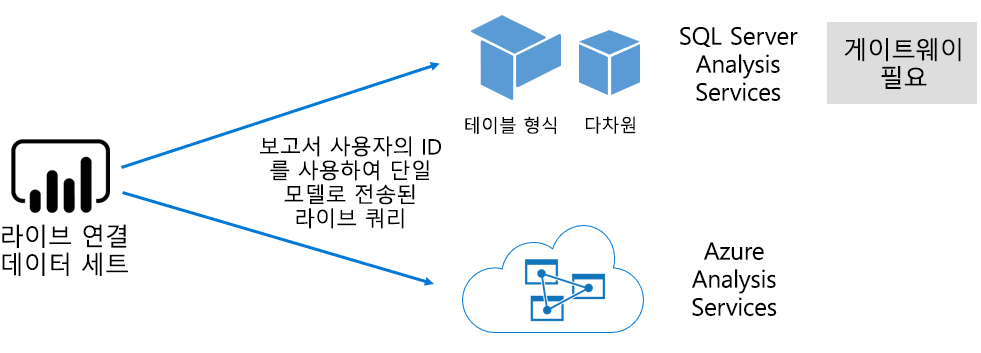

# Power BI 서비스의 데이터 세트

이 문서에서는 Power BI 데이터 세트에 대한 기술적 설명을 제공합니다.

## 데이터 세트 형식

Power BI 데이터 세트는 보고 및 시각화를 위해 준비된 데이터 원본을 나타냅니다. 다음과 같은 방법으로 생성된 5가지 데이터 세트 형식이 있습니다.

- Power BI 용량에서 호스트되지 않는 기존 데이터 모델에 연결
- 모델을 포함하는 Power BI Desktop 파일 업로드
- Excel 통합 문서(하나 이상의 Excel 테이블 및/또는 통합 문서 데이터 모델을 포함) 업로드 또는 CSV(쉼표로 구분된 값) 파일 업로드
- Power BI 서비스를 사용하여 [푸시 데이터 세트](../developer/automation/walkthrough-push-data.md) 만들기
- Power BI 서비스를 사용하여 [스트리밍 또는 하이브리드 스트리밍 데이터 세트](service-real-time-streaming.md) 만들기

스트리밍 데이터 세트를 제외하고, 데이터 세트는 [Analysis Services](/analysis-services/analysis-services-overview)의 완성된 모델링 기술을 활용하는 데이터 모델을 나타냅니다.

> [!NOTE]
> 이 설명서에서는 _데이터 세트_라는 용어와 _모델_이라는 혼용되는 경우가 있습니다. 일반적으로 Power BI 서비스 관점에서는 **데이터 세트**라고 하고, 개발 관점에서는 **모델**이라고 합니다. 이 설명서의 맥락에서는 거의 동일한 것을 의미합니다.

### 외부 호스트형 모델

외부 호스트형 모델에는 다음 두 가지 유형이 있습니다. SQL Server Analysis Services 및 [Azure Analysis Services](/azure/analysis-services/analysis-services-overview).

SQL Server Analysis Services 모델에 연결하려면 온-프레미스 또는 VM에서 호스트되는 IaaS(Infrastructure-as-a-Service) 모두 [온-프레미스 데이터 게이트웨이](service-gateway-onprem.md)를 설치해야 합니다. Azure Analysis Services는 게이트웨이가 필요하지 않습니다.

일반적으로 EDW(엔터프라이즈 데이터 웨어하우스)의 일부를 형성하는 기존 모델 투자가 있는 경우 Analysis Services에 연결하는 것이 좋습니다. Power BI는 Analysis Services에 대한 _라이브 연결_을 만들어 Power BI 보고서 사용자의 ID를 사용하여 데이터 사용 권한을 적용할 수 있습니다. SQL Server Analysis Services의 경우 다차원 모델(큐브) 및 테이블 형식 모델이 모두 지원됩니다. 다음 그림에 표시된 것처럼 라이브 연결 데이터 세트는 외부 호스트형 모델로 쿼리를 전달합니다.

### Power BI Desktop 개발 모델

Power BI Desktop(Power BI 개발을 위한 클라이언트 애플리케이션)은 모델을 개발하는 데 사용할 수 있습니다. 모델은 사실상 Analysis Services 테이블 형식 모델입니다. 모델은 데이터 흐름에서 데이터를 가져와 개발할 수 있으며, 그런 다음 외부 데이터 원본에 통합할 수 있습니다. 모델링을 구현하는 방법에 대한 자세한 내용은 이 문서에서 다루지 않지만 Power BI Desktop을 사용하여 개발할 수 있는 모델의 3가지 유형 또는 _모드_를 이해하는 것이 중요합니다. 이러한 모드는 데이터를 모델로 가져올지 아니면 데이터 원본에 유지할지를 결정합니다. 세 가지 모드는 다음과 같습니다. 가져오기, DirectQuery 및 복합. 각 모드에 대한 자세한 내용은 [Power BI 서비스의 데이터 세트 모드](service-dataset-modes-understand.md)를 참조하세요.

외부 호스트형 모델과 Power BI 데스크톱 모델은 RLS(행 수준 보안)를 적용하여 특정 사용자에 대해 검색되는 데이터를 제한할 수 있습니다. 예를 들어 **영업 사원** 보안 그룹에 할당된 사용자는 자신이 할당된 판매 지역에 대한 보고서 데이터만 볼 수 있습니다. RLS 역할은 _동적_ 또는 _정적_입니다. 동적 역할은 보고서 사용자를 기준으로 필터링되는 반면, 정적 역할은 역할에 할당된 모든 사용자에 대해 동일한 필터를 적용합니다. 자세한 내용은 [Power BI에서 RLS(행 수준 보안)](../admin/service-admin-rls.md)를 참조하세요.

### Excel 통합 문서 모델

[Excel 통합 문서](service-excel-workbook-files.md) 또는 [CSV 파일](service-comma-separated-value-files.md)을 기반으로 데이터 세트를 만들면 모델이 자동으로 만들어집니다. Excel 테이블과 CSV 데이터를 가져와 모델 테이블을 만들고, Excel 통합 문서 데이터 모델을 변환하여 Power BI 모델을 만듭니다. 모든 경우에서 파일 데이터를 모델로 가져옵니다.

## 요약

모델을 나타내는 Power BI 데이터 세트는 다음과 같이 구분할 수 있습니다.

- 데이터 세트는 Power BI 서비스에서 호스트되거나 Analysis Services에 의해 외부적으로 호스트됩니다.
- 데이터 세트는 가져온 데이터를 저장하거나, 기본 데이터 원본에 대한 통과 쿼리 요청을 실행하거나, 둘을 혼합하여 사용할 수 있습니다.

다음은 모델을 나타내는 Power BI 데이터 세트에 대한 중요한 사항의 요약입니다.

- SQL Server Analysis Services 호스트형 모델은 라이브 연결 쿼리를 수행하기 위해 게이트웨이가 필요합니다.
- 데이터를 가져오는 Power BI 호스트형 모델:
  - 쿼리할 수 있도록 메모리에 완전히 로드되어야 합니다.
  - 데이터를 최신 상태로 유지하기 위해 새로 고침이 필요하며, 인터넷을 통해 원본 데이터에 직업 액세스할 수 없는 경우에는 게이트웨이가 포함되어야 합니다.
- [DirectQuery](desktop-directquery-about.md) 스토리지 모드를 사용하는 Power BI 호스트형 모델에서는 원본 데이터에 대한 연결이 필요합니다. 모델을 쿼리하면 Power BI는 원본 데이터에 대한 쿼리를 실행하여 현재 데이터를 검색합니다. 인터넷을 통해 원본 데이터에 직접 액세스할 수 없는 경우 이 모드에는 게이트웨이가 포함되어야 합니다.
- 모델은 특정 사용자에 대한 데이터 액세스를 제한하는 필터를 사용하여 RLS 규칙을 적용할 수 있습니다.

## 고려 사항

Power BI를 성공적으로 배포하고 관리하려면 모델이 호스트되는 위치, 스토리지 모드, 게이트웨이 종속성, 가져온 데이터 크기, 새로 고침 유형 및 빈도를 이해하는 것이 중요합니다. 이러한 구성은 모두 Power BI 용량 리소스에 상당한 영향을 미칠 수 있습니다. 또한 모델 디자인 자체는 데이터 준비 쿼리, 관계 및 계산을 포함하여 모두 고려 사항에 추가됩니다.

Power BI 호스트형 가져오기 모델을 일정에 따라 새로 고치거나 Power BI 서비스 사용자가 요청 시 트리거할 수 있음을 이해하는 것도 중요합니다.

## 다음 단계

- [Power BI 서비스의 데이터 세트 모드](service-dataset-modes-understand.md)
- 궁금한 점이 더 있나요? [Power BI 커뮤니티에 질문합니다.](https://community.powerbi.com/)
