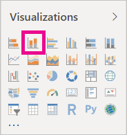
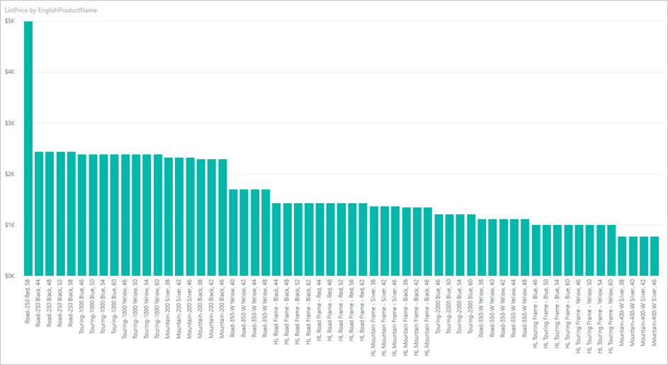

# <a name="refresh-data-from-an-on-premises-sql-server-database"></a>온-프레미스 SQL Server 데이터베이스에서 데이터 새로 고침

이 자습서에서는 로컬 네트워크의 온-프레미스에 있는 관계형 데이터베이스에서 Power BI 데이터 세트를 새로 고치는 방법을 살펴봅니다. 특히, 이 자습서에서는 Power BI가 온-프레미스 데이터 게이트웨이를 통해 액세스해야 하는 샘플 SQL Server 데이터베이스를 사용합니다.

이 자습서에서 수행하는 단계는 다음과 같습니다.

> [!div class="checklist"]
> * 온-프레미스 SQL Server 데이터베이스에서 데이터를 가져오는 Power BI Desktop(.pbix) 파일을 만들고 게시합니다.
> * 데이터 게이트웨이를 통한 SQL Server 연결을 위해 Power BI에서 데이터 원본 및 데이터 세트 설정을 구성합니다.
> * Power BI 데이터 세트에 최신 데이터가 있는지 확인하려면 새로 고침 일정을 구성합니다.
> * 데이터 세트의 요청 시 새로 고침을 수행합니다.
> * 새로 고침 기록을 검토하여 이전 새로 고침 주기의 결과를 분석합니다.
> * 이 자습서에서 만든 아티팩트를 삭제하여 리소스를 정리합니다.

## <a name="prerequisites"></a>사전준비

- 아직 없는 경우, 시작하기 전에 [Power BI 평가판](https://app.powerbi.com/signupredirect?pbi_source=web)에 등록합니다.
- 로컬 컴퓨터에 [Power BI Desktop을 설치](https://powerbi.microsoft.com/desktop/)합니다.
- 로컬 컴퓨터에 [SQL Server를 설치](/sql/database-engine/install-windows/install-sql-server)하고 [백업에서 샘플 데이터베이스](https://github.com/Microsoft/sql-server-samples/releases/download/adventureworks/AdventureWorksDW2017.bak)를 복원합니다. AdventureWorks에 대한 자세한 내용은 [AdventureWorks 설치 및 구성](/sql/samples/adventureworks-install-configure)을 참조하세요.
- SQL Server와 동일한 로컬 컴퓨터(프로덕션에서는 일반적으로 다른 컴퓨터가 됨)에 [온-프레미스 데이터 게이트웨이를 설치](service-gateway-onprem.md)합니다.

> [!NOTE]
> 게이트웨이 관리자가 아니고 직접 게이트웨이를 설치하지 않으려는 경우 조직의 게이트웨이 관리자에게 문의하세요. 데이터 세트를 SQL Server 데이터베이스에 연결하는 데 필요한 데이터 원본 정의를 만들 수 있습니다.

## <a name="create-and-publish-a-power-bi-desktop-file"></a>Power BI Desktop 파일 생성 및 게시

AdventureWorksDW 샘플 데이터베이스를 사용하여 기본 Power BI 보고서를 만들려면 다음 절차를 수행합니다. 보고서를 Power BI에 게시하면 Power BI에서 데이터 세트를 가져올 수 있습니다. 그런 다음, 후속 단계에서 이를 구성하고 새로 고칠 수 있습니다.

1. Power BI Desktop의 **홈** 탭에서 **데이터 가져오기** \> **SQL Server**를 선택합니다.

2. **SQL Server 데이터베이스** 대화 상자에 **서버** 및 **데이터베이스(선택 사항)** 이름을 입력하고 **데이터 연결 모드**가 **가져오기**인지 확인한 다음, **확인**을 선택합니다.

    

    이 자습서에서는 **고급 옵션**을 사용하지 않지만 SQL 문을 지정하고 [SQL Server 장애 조치(Failover)](/sql/database-engine/availability-groups/windows/failover-clustering-and-always-on-availability-groups-sql-server)를 사용하는 등의 다른 옵션을 설정할 수 있습니다.

    

3. **자격 증명**을 확인한 다음, **연결**을 선택합니다.

    > [!NOTE]
    > 인증할 수 없는 경우 올바른 인증 방법을 선택하고 데이터베이스 액세스 권한이 있는 계정을 사용해야 합니다. 테스트 환경에서는 데이터베이스 인증을 명시적 사용자 이름과 암호로 사용할 수 있습니다. 프로덕션 환경에서는 일반적으로 Windows 인증을 사용합니다. [새로 고침 시나리오 문제 해결](refresh-troubleshooting-refresh-scenarios.md)을 참조하고 데이터베이스 관리자에게 추가 지원을 요청하세요.

1. **암호화 지원** 대화 상자가 나타나면 **확인**을 선택합니다.

2. **탐색기** 대화 상자에서 **DimProduct** 테이블을 선택한 다음, **로드**를 선택합니다.

    

3. Power BI Desktop **보고서** 보기의 **시각화** 창에서 **누적 세로 막대형 차트**를 선택합니다.

    

4. 보고서 캔버스에서 세로 막대형 차트를 선택한 상태로 **필드** 창에서 **EnglishProductName** 및 **ListPrice** 필드를 선택합니다.

    

5. **EndDate**를 **보고서 수준 필터**로 끌어다 놓고 **기본 필터링** 아래에서 **(비어 있음)** 에 대한 확인란만 선택합니다.

    

    이제 차트는 다음과 같이 표시됩니다.

    

    5개의 **Road-250** 제품이 가장 높은 가격으로 나열됩니다. 이 값은 이 자습서의 뒷부분에서 데이터를 업데이트하고 보고서를 새로 고치면 변경됩니다.

6. 보고서를 "AdventureWorksProducts.pbix"라는 이름으로 저장합니다.

7. **홈** 탭에서 **게시** \> **내 작업 영역** \> **선택**을 선택합니다. 로그인할지 묻는 메시지가 표시되면 Power BI 서비스에 로그인합니다.

8. **성공** 화면에서 **Power BI에서 'AdventureWorksProducts.pbix' 열기**를 선택합니다.

    [Power BI에 게시](./media/service-gateway-sql-tutorial/publish-to-power-bi.png)

## <a name="connect-a-dataset-to-a-sql-server-database"></a>SQL Server 데이터베이스에 데이터 세트 연결

Power BI Desktop에서 온-프레미스 SQL Server 데이터베이스에 직접 연결했지만 Power BI 서비스를 사용하려면 클라우드와 온-프레미스 네트워크 간의 브리지 역할을 하는 데이터 게이트웨이가 필요합니다. 다음 단계에 따라 온-프레미스 SQL Server 데이터베이스를 게이트웨이에 데이터 원본으로 추가한 다음, 데이터 세트를 이 데이터 원본에 연결합니다.

1. Power BI에 로그인합니다. 오른쪽 위 모서리에서 설정 기어 아이콘을 선택한 다음, **설정**을 선택합니다.

    

2. **데이터 세트** 탭에서 **AdventureWorksProducts** 데이터 세트를 선택하면 데이터 게이트웨이를 통해 온-프레미스 SQL Server 데이터베이스에 연결할 수 있습니다.

3. **게이트웨이 연결**을 확장하고 하나 이상의 게이트웨이가 나열되어 있는지 확인합니다. 게이트웨이가 없는 경우 이 자습서의 앞부분에 있는 [필수 구성 요소](#prerequisites) 섹션에서 게이트웨이 설치 및 구성을 위한 제품 문서에 대한 링크를 참조하세요.

    

4. **작업**에서 설정/해제 단추를 확장하여 데이터 원본을 보고 **게이트웨이에 추가** 링크를 선택합니다.

    

    > [!NOTE]
    > 게이트웨이 관리자가 아니고 직접 게이트웨이를 설치하지 않으려는 경우 조직의 게이트웨이 관리자에게 문의하세요. 데이터 세트를 SQL Server 데이터베이스에 연결하는 데 필요한 데이터 원본 정의를 만들 수 있습니다.

5. **게이트웨이** 관리 페이지의 **데이터 원본 설정** 탭에서 다음 정보를 입력 및 확인하고 **추가**를 선택합니다.

    | 옵션 | Value |
    | --- | --- |
    | 데이터 원본 이름 | AdventureWorksProducts |
    | 데이터 원본 유형 | SQL Server |
    | 서버 | SQLServer01과 같은 SQL Server 인스턴스의 이름(Power BI Desktop에 지정한 내용과 동일해야 함). |
    | 데이터베이스 | AdventureWorksDW와 같은 SQL Server 데이터베이스의 이름(Power BI Desktop에 지정한 내용과 동일해야 함). |
    | 인증 방법 | Windows 또는 Basic(일반적으로 Windows). |
    | 사용자 이름 | SQL Server에 연결하는 데 사용하는 사용자 계정입니다. |
    | 암호 | SQL Server에 연결하는 데 사용하는 계정의 암호입니다. |

    

6. **데이터 세트** 탭에서 **게이트웨이 연결** 섹션을 다시 확장합니다. 구성한 데이터 게이트웨이를 선택합니다. 이 게이트웨이는 설치한 머신에서 실행 중인 **상태**를 표시하고 **적용**을 선택합니다.

    

## <a name="configure-a-refresh-schedule"></a>새로 고침 일정 구성

이제 데이터 게이트웨이를 통해 Power BI의 데이터 세트를 SQL Server 데이터베이스 온-프레미스에 연결한 후 다음 단계에 따라 새로 고침 일정을 구성합니다. 일정에 따라 데이터 세트를 새로 고치면 보고서와 대시보드에 최신 데이터가 있는지 확인하는 데 도움이 됩니다.

1. 탐색 창에서 **내 작업 영역** \> **데이터 세트**를 엽니다. **AdventureWorksProducts** 데이터 세트에 대한 줄임표( **. . .** )를 선택한 다음, **새로 고침 일정**을 선택합니다.

    > [!NOTE]
    > 동일한 이름의 보고서에 대한 줄임표가 아닌 **AdventureWorksProducts** 데이터 세트에 대한 줄임표를 선택해야 합니다. **AdventureWorksProducts** 보고서의 컨텍스트 메뉴에 **새로 고침 일정** 옵션이 포함되어 있지 않습니다.

2. **예약된 새로 고침** 섹션의 **데이터를 최신 상태로 유지**에서 새로 고침을 **설정**으로 변경합니다.

3. 적절한 **새로 고침 빈도**(이 예의 경우 **매일**)를 선택한 다음, **시간**에서 **다른 시간 추가**를 선택하여 원하는 새로 고침 시간(이 예의 경우 오전 및 오후 6:30)을 지정합니다.

    

    > [!NOTE]
    > 데이터 세트가 공유 용량에 있는 경우 최대 8개의 일일 시간 슬롯을 구성하거나 Power BI Premium에서 48개의 시간 슬롯을 구성할 수 있습니다.

4. **새로 고침 실패 알림 이메일 보내기** 확인란을 활성화한 채로 두고 **적용**을 선택합니다.

## <a name="perform-an-on-demand-refresh"></a>요청 시 새로 고침 수행

새로 고침 일정을 구성했으므로 Power BI는 15분 이내에 다음 예약된 시간에 데이터 세트를 새로 고칩니다. 게이트웨이 및 데이터 원본 구성을 테스트하는 것과 같이 데이터를 더 빨리 새로 고치려면, 탐색 창의 데이터 세트 메뉴에서 **지금 새로 고침** 옵션을 사용하여 요청 시 새로 고침을 수행합니다. 요청 시 새로 고침은 다음 예약된 새로 고침 시간에는 영향을 주지 않지만, 이전 섹션에서 언급한 일일 새로 고침 제한 사항에 불리하게 작용합니다.

예를 들어 SSMS(SQL Server Management Studio)를 사용하여 AdventureWorksDW 데이터베이스의 DimProduct 테이블을 업데이트하여 샘플 데이터의 변경 내용을 시뮬레이션합니다.

```sql

UPDATE [AdventureWorksDW].[dbo].[DimProduct]
SET ListPrice = 5000
WHERE EnglishProductName ='Road-250 Red, 58'

```

이제 업데이트된 데이터가 게이트웨이 연결을 통해 데이터 세트와 Power BI의 보고서로 흐를 수 있도록 다음 단계를 수행합니다.

1. Power BI Service의 탐색 창에서 **내 작업 영역**을 선택하고 확장합니다.

2. **데이터 세트**에서**AdventureWorksProducts** 데이터 세트에 대한 줄임표( **. . .** )를 선택한 다음, **지금 새로 고침**을 선택합니다.

    

    오른쪽 위 모서리에 있는 Power BI는 요청된 새로 고침을 수행할 준비를 하고 있습니다.

3. **내 작업 영역 \> 보고서 \> AdventureWorksProducts**를 선택합니다. 업데이트된 데이터가 어떻게 전달되는지 확인하고, 현재 가장 높은 가격의 제품이**Road-250 Red, 58**입니다.

    

## <a name="review-the-refresh-history"></a>새로 고침 기록 검토

새로 고침 기록에서 이전 새로 고침 주기의 결과를 주기적으로 확인하는 것이 좋습니다. 데이터베이스 자격 증명이 만료되었거나 예약된 새로 고침이 만료되었을 때 선택한 게이트웨이가 오프라인 상태일 수 있습니다. 다음 단계에 따라 새로 고침 기록을 검토하고 문제를 확인합니다.

1. Power BI 사용자 인터페이스의 오른쪽 위 모서리에서 설정 기어 아이콘을 선택한 다음, **설정**을 선택합니다.

2. **데이터 세트**로 전환하고 검사할 **AdventureWorksProducts**와 같은 데이터 세트를 선택합니다.

3. **새로 고침 기록** 링크를 선택하여 **새로 고침 기록** 대화 상자를 엽니다.

    

4. **예약** 탭에서 해당 **시작**과 **종료** 시간 및 Power BI가 새로 고침을 성공적으로 수행했음을 나타내는 **완료됨** 의 **상태** 로 이전 예약 및 요청 시 새로 고침을 확인합니다. 새로 고침이 실패한 경우 오류 메시지를 보고 오류 세부 정보를 살펴볼 수 있습니다.

    

    > [!NOTE]
    > OneDrive 탭은 [Power BI에서 데이터 새로 고침](refresh-data.md)에 자세히 설명된 대로 Power BI Desktop 파일, Excel 통합 문서나 OneDrive 또는 SharePoint Online의 CSV 파일에 연결된 데이터 세트만 관련이 있습니다.

## <a name="clean-up-resources"></a>리소스 정리

샘플 데이터를 더 이상 사용하지 않으려면 데이터베이스를 SSMS(SQL Server Management Studio)에서 삭제합니다. SQL Server 데이터 원본을 사용하지 않으려면 데이터 게이트웨이에서 데이터 원본을 제거합니다. 또한 이 자습서를 완료할 용도로 설치하는 경우에만 데이터 게이트웨이를 제거하는 것이 좋습니다. AdventureWorksProducts.pbix 파일을 업로드할 때 Power BI에서 만든 AdventureWorksProducts 데이터 세트 및 AdventureWorksProducts 보고서를 삭제해야 합니다.

## <a name="next-steps"></a>다음 단계

이 자습서에서는 온-프레미스 SQL Server 데이터베이스에서 Power BI 데이터 세트로 데이터를 가져오는 방법과 Power BI에서 이 데이터 세트를 사용하는 보고서와 대시보드를 업데이트된 상태로 유지하기 위해 예약 및 요청 방식으로 이 데이터 세트를 새로 고치는 방법에 대해 살펴보았습니다. 이제 Power BI에서 데이터 게이트웨이 및 데이터 원본을 관리하는 방법에 대해 자세히 알아볼 수 있습니다. Power BI에서 데이터 새로 고침 개념 문서를 검토하는 것도 좋은 방법일 수 있습니다.

- [온-프레미스 데이터 게이트웨이 관리](/data-integration/gateway/service-gateway-manage)
- [데이터 원본 관리 - 가져오기/예약된 새로 고침](service-gateway-enterprise-manage-scheduled-refresh.md)
- [Power BI에서 데이터 새로 고침](refresh-data.md)
