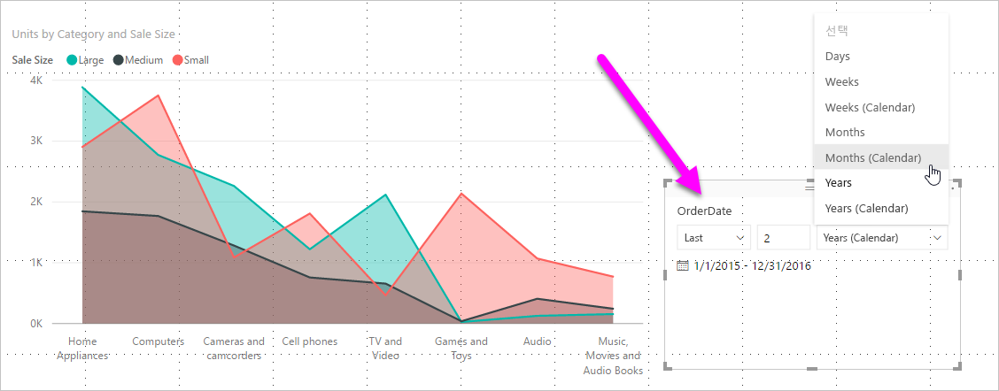
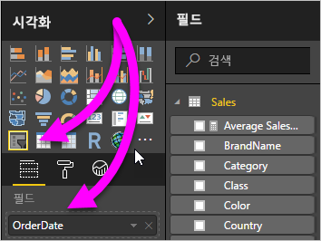
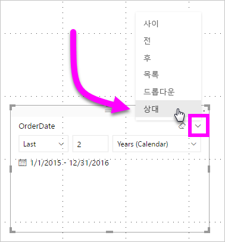
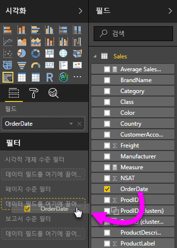
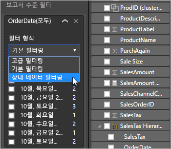
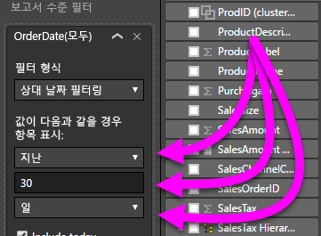

# Power BI에서 상대 날짜 슬라이서 및 필터 사용

[!INCLUDE [applies-to](../includes/applies-to.md)] [!INCLUDE [yes-desktop](../includes/yes-desktop.md)] [!INCLUDE [yes-service](../includes/yes-service.md)]

**상대 날짜 슬라이서** 또는 **상대 날짜 필터**를 사용하면 데이터 모델의 모든 날짜 열에 시간 기반 필터를 적용할 수 있습니다. 예를 들어 **상대 날짜 슬라이서**를 사용하여 지난 30일(또는 월, 달력 월 등) 이내에 발생한 판매 데이터만 표시할 수 있습니다. 데이터를 새로 고치면 상대 기간에 적절한 상대 날짜 제약 조건이 자동으로 적용됩니다.

## 상대 날짜 범위 슬라이서 사용

다른 슬라이서와 마찬가지로 상대 날짜 슬라이서를 사용할 수 있습니다. 보고서에 대한 **슬라이서** 시각적 개체를 만든 다음, **필드** 값에 대해 날짜 값을 선택합니다. 다음 이미지에서는 *OrderDate* 필드를 선택했습니다.

캔버스에서 슬라이서를 선택한 다음, 슬라이서 시각적 개체의 오른쪽 위 모서리에 있는 캐럿을 선택합니다. 시각적 개체에 날짜 데이터가 있는 경우 메뉴에 **상대**에 대한 옵션이 표시됩니다.

상대 날짜 슬라이서의 경우 *상대*를 선택합니다.

그런 다음, 설정을 선택할 수 있습니다.

*상대 날짜 슬라이서*의 첫 번째 설정의 경우 다음 선택 항목이 제공됩니다.

* Last

* 다음

* 이

*상대 날짜 슬라이서*의 두 번째(가운데) 설정을 사용하면 상대 날짜 범위를 정의하는 숫자를 입력할 수 있습니다.

세 번째 설정을 사용하여 날짜 측정을 선택할 수 있습니다. 다음 옵션이 있습니다.

* 일

* 주

* 주(달력)

* 월

* 개월(달력)

* 연도

* 년(달력)

해당 목록에서 **월**을 선택하고 가운데 설정에 *2*를 입력하면 다음과 같이 됩니다.

* 오늘이 7월 20일인 경우

* 슬라이서에 의해 제한된 시각적 개체에 포함된 데이터는 이전 두 달 동안의 데이터를 보여줍니다.

* 5월 21일부터 7월 20일까지(오늘 날짜)

이에 비해 *개월(달력)* 을 선택한 경우, 제한된 시각적 개체는 5월 1일부터 6월 30일(달력상의 최근 두 달)까지의 데이터를 보여줍니다.

## 상대 날짜 범위 필터 사용

보고서 페이지 또는 전체 보고서에 대한 상대 날짜 범위 필터를 만들 수도 있습니다. 이렇게 하려면 **필드** 창의 **페이지 수준 필터** 또는 **보고서 수준 필터**로 끌어다 놓습니다.

여기에서 상대 날짜 범위를 변경할 수 있습니다. **상대 날짜 슬라이서**를 사용자 지정하는 방법과 유사합니다. **필터 형식** 드롭다운에서 **상대 날짜 필터링**을 선택합니다.

**상대 날짜 필터링**을 선택하면 슬라이서와 마찬가지로 가운데에 있는 숫자 상자를 포함하여 변경할 세 개의 섹션이 표시됩니다.

## 제한 사항 및 고려 사항

다음 제한 사항 및 고려 사항은 현재 **상대 날짜 범위 슬라이서**와 필터에 적용되는 것입니다.

* **Power BI**의 데이터 모델에는 표준 시간대 정보가 포함되어 있지 않습니다. 모델에서 시간은 저장할 수 있지만 해당 표준 시간대가 표시되지 않습니다.

* 슬라이서 및 필터는 항상 UTC의 시간을 기반으로 합니다. 보고서에 필터를 설정하고 다른 표준 시간대에 있는 동료에게 보내면 둘 다 같은 데이터를 볼 수 있습니다. UTC 표준 시간대가 아닌 경우 사용자와 동료는 발생하는 시간 오프셋을 고려해야 합니다.

* **쿼리 편집기**를 사용하여 현지 표준 시간대에서 캡처된 데이터를 UTC로 변환할 수 있습니다.

## 다음 단계

[Power BI Desktop에서 그룹화 및 범주화 사용](../desktop-grouping-and-binning.md) 방법에 대해 알아봅니다.
