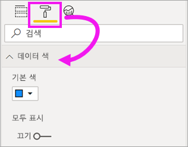
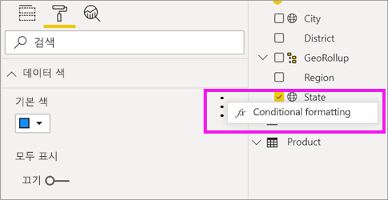
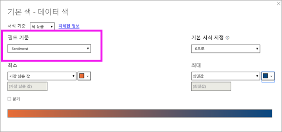
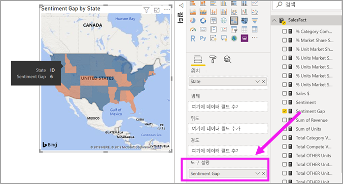

# Power BI의 등치 지역도(단계구분도) 만들기 및 사용

[!INCLUDE[consumer-appliesto-nyyn](../includes/consumer-appliesto-nyyn.md)]

[!INCLUDE [power-bi-visuals-desktop-banner](../includes/power-bi-visuals-desktop-banner.md)]

등치 지역도는 음영 또는 색조 또는 패턴을 사용하여 특정 값이 특정 지리 또는 지역을 기준으로 어떻게 다른지 표시합니다.  밝게(낮은 빈도/낮음)부터 어둡게(높은 빈도/높음)까지 다양한 음영으로 이러한 상대적 차이를 신속하게 표시합니다.    

## Bing에 전달되는 내용
Power BI는 Bing과 통합되어 기본 맵 좌표를 제공합니다(지오코딩이라는 프로세스). Power BI 서비스 또는 Power BI Desktop에서 맵 시각화를 만드는 경우 **위치**, **위도** 및 **경도** 버킷의 데이터(해당 시각화를 만드는 데 사용되는)가 Bing에 전송됩니다.

사용자 또는 사용자의 관리자는 지오코딩에 URL Bing을 사용할 수 있도록 방화벽을 업데이트해야 할 수 있습니다.  이러한 URL은 다음과 같습니다.
- https://dev.virtualearth.net/REST/V1/Locations    
- https://platform.bing.com/geo/spatial/v1/public/Geodata    
- https://www.bing.com/api/maps/mapcontrol

Bing에 전송되는 데이터에 대한 자세한 내용 및 지오코딩 성공을 높이기 위한 팁은 [맵 시각화를 위한 팁과 트릭](power-bi-map-tips-and-tricks.md)을 참조하세요.

## 등치 지역도를 사용하는 경우
다음과 같은 경우 등치 지역도를 사용하는 것이 좋습니다.

* 지도에 정량 정보를 표시하는 경우
* 공간 패턴과 관계를 표시하는 경우
* 데이터가 표준화된 경우
* 사회 경제 데이터로 작업하는 경우
* 정의된 영역이 중요한 경우
* 지리적 위치 분포에 대한 개요를 확인하려는 경우

### 필수 조건
이 자습서는 [영업 및 마케팅 샘플 PBIX 파일](https://download.microsoft.com/download/9/7/6/9767913A-29DB-40CF-8944-9AC2BC940C53/Sales%20and%20Marketing%20Sample%20PBIX.pbix)을 사용합니다.
1. 메뉴 모음의 왼쪽 위 섹션에서 **파일** > **열기**를 선택합니다.
   
2. **영업 및 마케팅 샘플 PBIX 파일**의 복사본을 찾습니다.

1. 보고서 보기 에서 **영업 및 마케팅 샘플 PBIX 파일**을 엽니다.

1. 새 페이지를 추가하기 위해  탭을 선택합니다.

> [!NOTE]
> Power BI 동료와 보고서를 공유하려면 개별 Power BI Pro 라이선스가 있거나 보고서가 Premium 용량에 저장되어 있어야 합니다.    

### 등치 지역도 만들기
1. 필드 창에서 **Geo** \> **State** 필드를 선택합니다.    

   
2. 등치 지역도로 [차트를 변환](power-bi-report-change-visualization-type.md)합니다. **State**는 현재 **위치** 영역에 있습니다. Bing 지도는 **위치** 영역의 필드를 사용하여 지도를 만듭니다.  위치는 국가, 시/도, 지방, 구/군, 우편번호 등 다양한 유효한 위치가 될 수 있습니다. Bing 지도에서는 전 세계 여러 위치에 대한 등치 지역도 셰이프를 제공합니다. 위치 영역에 유효한 항목이 없으면 Power BI가 등치 지역도를 만들 수 없습니다.  

   
3. 미국 대륙만 표시하려면 지도를 필터링하세요.

   a.  시각화 창 왼쪽에서 **필터** 창을 찾습니다. 최소화된 경우 확장

   b.  **State**를 마우스로 가리키고 확장 펼침 버튼을 선택합니다.  
   

   c.  **모두** 옆의 확인 표시를 표시하고 **AK** 옆에 있는 확인 표시를 제거합니다.

   
4. 페인트 롤러 아이콘을 선택하여 서식 창을 열고 **데이터 색**을 선택합니다.

    

5. 세 개의 세로 점을 선택하고 **조건부 서식 지정**을 선택합니다.

    

6. 등치 지역도의 음영 처리 방법을 확인하려면 **기본 색 - 데이터 색** 화면을 사용합니다. 사용할 수 있는 옵션에는 음영을 기준으로 할 필드와 음영을 적용하는 방법이 포함됩니다. 이 예제에서는 **SalesFact** > **Sentiment** 필드를 사용하고 감정의 가장 낮은 값을 주황색으로, 가장 높은 값을 파란색으로 설정합니다. 최댓값과 최솟값 사이의 값은 주황색과 파란색의 음영으로 표시됩니다. 화면 하단의 그림은 사용할 색의 범위를 보여줍니다. 

    

7. 등치 지역도는 녹색과 빨간색으로 채워지며, 빨간색은 낮은 인지 수를 나타내고 녹색은 더 높고 더 긍정적인 인지를 나타냅니다.  추가 세부 정보를 표시하려면 도구 설명으로 필드를 끌어다 놓습니다.  여기서는 **SalesFact** > **Sentiment gap**을 추가했습니다. 아이다호(ID)의 상태를 강조 표시하면 감정 차이가 낮음(6)을 나타냅니다.
   

10. [보고서를 저장합니다](../service-report-save.md).

Power BI를 사용하면 등치 지역도의 모양을 다양한 방식으로 제어할 수 있습니다. 원하는 모양을 얻을 때까지 이 데이터 색 컨트롤을 다양하게 조정합니다. 

## 강조 표시 및 교차 필터링
필터 창 사용 방법에 대한 자세한 내용은 [보고서에 필터 추가](../power-bi-report-add-filter.md)를 참조하세요.

보고서 페이지에서 다른 시각화 요소를 교차 필터링하는 등치 지역도에서 위치를 강조 표시하고 그 반대의 경우도 마찬가지입니다.

1. 이를 수행하려면 먼저 **파일 > 저장**을 선택하여 이 보고서를 저장합니다. 

2. Ctrl+C를 사용하여 등치 지역도를 복사합니다.

3. 보고서 캔버스 아래쪽에서 **Sentiment** 탭을 선택하여 Sentiment 보고서 페이지를 엽니다.

    

4. 페이지의 시각화를 이동하고 크기를 조정하여 일부 공간을 만든 다음, CTRL-V를 사용하여 이전 보고서의 등치 지역도를 붙여넣습니다. (다음의 이미지를 참고하세요)

   

5. 등치 지역도에서 시/도를 선택합니다.  이는 페이지의 다른 시각화 요소를 교차 강조 및 교차 필터링합니다. 예를 들어 **텍사스**를 선택하면 카드를 교차 필터링하고 가로 막대형 차트를 교차 강조 표시합니다. 이를 통해 감정이 75이고 텍사스가 Central District #23에 있음을 알 수 있습니다.   
   
2. VanArsdel - Sentiment by Month 꺾은선형 차트에서 데이터 요소를 선택합니다. 이는 등치 지역도를 필터링하여 경쟁 대상이 아닌 VanArsdel에 대한 감정 데이터를 표시합니다.  
   

## 고려 사항 및 문제 해결
지도 데이터는 모호해질 수 있습니다.  예를 들어 프랑스 파리가 있지만 텍사스 파리도 있습니다. 지리적 데이터는 구/군 이름 또는 시/도 이름별로 별도의 열에 저장될 것입니다. 따라서 Bing은 이 파리가 어디에 있는 파리인지 알려줄 수 없습니다. Power BI에는 데이터 세트에 위도 및 경도 데이터가 이미 있는 경우 지도 데이터를 명확하게 만들기 위한 특별한 필드가 있습니다. 위도 데이터가 포함된 필드를 시각화 \> 위도 영역으로 끌어다 놓기만 하면 됩니다.  경도 데이터의 경우에도 마찬가지입니다.    

Power BI Desktop의 데이터 세트를 편집할 수 있는 권한이 있는 경우 지도 모호성 해결을 위해 이 비디오를 시청하세요.

> [비디오 https://www.youtube.com/embed/Co2z9b-s_yM ]

위도 및 경도 데이터에 액세스할 수 없지만 데이터 세트에 대한 편집 액세스 권한이 있는 경우 [이 지침을 따라 데이터 세트를 업데이트하세요](https://support.office.com/article/Maps-in-Power-View-8A9B2AF3-A055-4131-A327-85CC835271F7).

지도 시각화에 대한 자세한 도움말은 [지도 시각화를 위한 팁과 힌트](../power-bi-map-tips-and-tricks.md)를 참조하세요.

## 다음 단계

[도형 맵](desktop-shape-map.md)

[Power BI의 시각화 유형](power-bi-visualization-types-for-reports-and-q-and-a.md)
