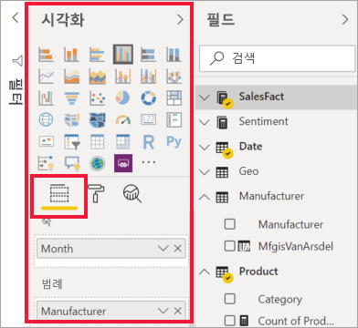
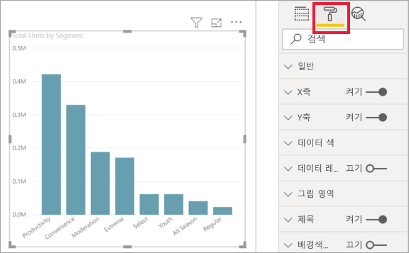
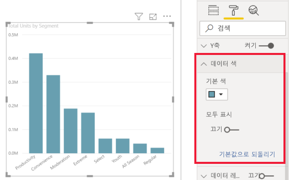
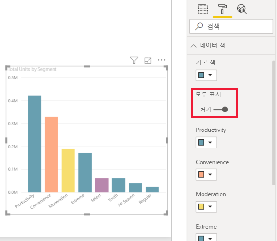
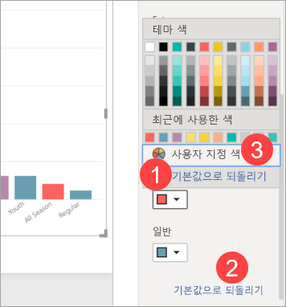
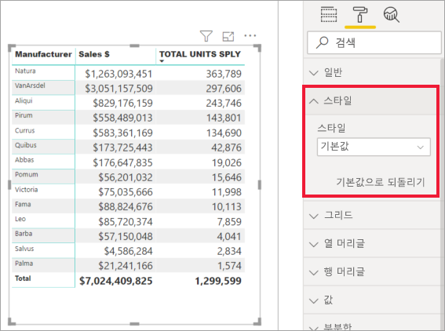
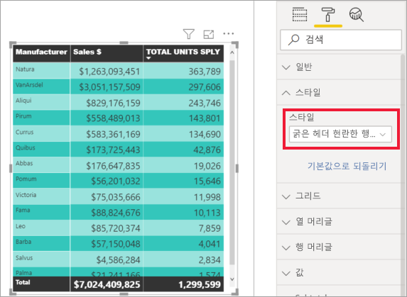
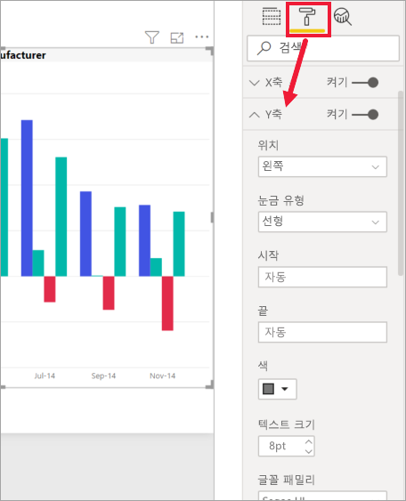
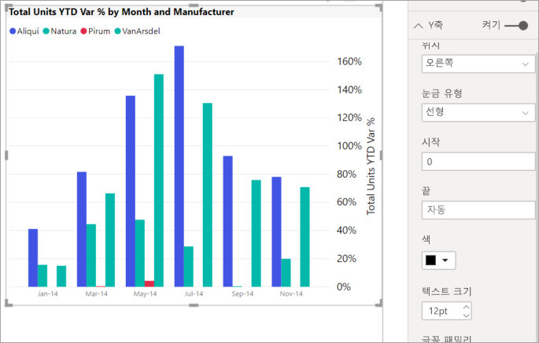
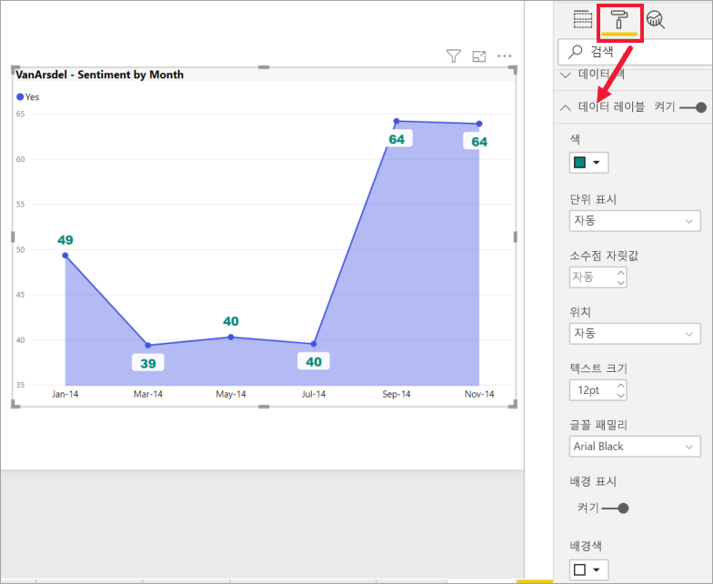

# 서식 창을 사용하여 시작

[!INCLUDE[consumer-appliesto-nyyn](../includes/consumer-appliesto-nyyn.md)]    

보고서에 대한 편집 권한이 있는 경우 다양한 서식 옵션을 사용할 수 있습니다. Power BI 보고서에서 데이터 계열, 데이터 요소 및 시각화의 배경까지도 변경할 수 있습니다. X축과 Y축이 표시되는 방식을 변경할 수 있습니다. 시각화, 셰이프 및 제목의 글꼴 속성을 지정할 수도 있습니다. Power BI에서 보고서가 표시되는 방식을 완전히 제어할 수 있습니다.

시작하려면 Power BI Desktop 또는 Power BI 서비스에서 보고서를 엽니다. 둘 다 거의 동일한 서식 옵션을 제공합니다. Power BI 서비스에서 보고서를 여는 경우 메뉴 모음에서 **편집**을 선택하세요. 

보고서를 편집하고 시각화를 선택한 경우 **시각화** 창이 나타납니다. 이 창을 사용하여 시각화를 변경합니다. **시각화** 창 바로 아래에는 **필드** 아이콘(막대 모음) **서식** 아이콘(페인트 롤러) 및 **분석** 아이콘(돋보기) 등 세 가지 아이콘이 있습니다. 아래 이미지에서는 **필드** 아이콘을 선택했으며 아이콘 아래 노란색 막대로 표시됩니다.

**서식**을 선택하면 아이콘 아래 영역에 현재 선택한 시각화에 사용할 수 있는 사용자 지정이 표시됩니다.  

각 시각화의 여러 요소를 사용자 지정할 수 있습니다. 사용 가능한 옵션은 선택한 시각적 개체에 따라 달라집니다. 옵션 중 일부는 다음과 같습니다.

* 범례
* X축
* Y축
* 데이터 색
* 데이터 레이블
* 도형
* 플롯 영역
* title
* 배경
* 가로 세로 비율 잠금
* 테두리
* 도구 설명
* 시각적 개체 헤더
* 도형
* 위치    
기타 작업

> [!NOTE]
>  
> 각 시각화 유형의 이러한 요소가 모두 표시되지 않습니다. 선택한 시각화에 따라 사용 가능한 사용자 지정이 달라집니다. 예를 들어 원형 차트에는 X축이 없으므로 원형 차트를 선택한 경우 X축이 표시되지 않습니다.

또한 선택한 시각화가 없는 경우 아이콘이 있는 위치에 **필터**가 나타나며 필터를 페이지의 모든 시각화에 적용할 수 있습니다.

서식 옵션 사용 방법을 배우려면 직접 사용해 보는 것이 가장 좋습니다. 언제든 변경 내용을 취소하거나 기본값으로 되돌릴 수 있습니다. 사용할 수 있는 옵션은 상당히 많으며 새 옵션이 계속 추가됩니다. 한 문서에서 모든 서식 옵션을 설명할 수는 없지만, 시작하는 데 도움이 되도록 몇 가지를 함께 검토해 보겠습니다. 

1. 시각적 개체에 사용되는 색 변경   
2. 스타일 적용    
3. 축 속성 변경    
4. 데이터 레이블 추가    

## 색 작업

시각화에서 색을 사용자 지정하기 위해 필요한 단계를 살펴보겠습니다.

1. 시각화를 선택하여 활성화합니다.

2. 페인트 롤러 아이콘을 선택하여 서식 탭을 엽니다. 서식 탭에는 선택한 시각적 개체에 사용할 수 있는 모든 서식 요소가 표시됩니다.

    

3. **데이터 색**을 선택하여 사용 가능한 사용자 지정을 확장합니다.  

    

4. **모두 표시**를 켜기로 변경하고 열의 색을 다르게 선택합니다.

    

색 작업을 위한 몇 가지 유용한 팁은 다음과 같습니다. 다음 목록에 있는 숫자는 다음 화면에도 표시되며 이러한 유용한 요소에 액세스하거나 변경할 수 있는 위치를 나타냅니다.

1. 색이 마음에 들지 않나요? 걱정하지 마세요. **기본값으로 되돌리기**를 선택하면 선택 항목이 기본 설정으로 되돌려집니다. 

2. 색 변경이 모두 마음에 들지 않나요? **데이터 색** 섹션의 아래쪽에서 **기본값으로 되돌리기**를 선택하면 색이 기본 설정으로 되돌려집니다. 

3. 색상표에 없는 색을 원하시나요? **사용자 지정 색**을 선택하고 스펙트럼에서 선택하면 됩니다.  

   

방금 변경한 사항이 마음에 들지 않으세요? 작업을 수행했을 때처럼 **CTRL+Z** 를 사용하여 실행 취소하면 됩니다.

## 테이블에 스타일 적용
일부 Power BI 시각화에는 **스타일** 옵션이 있습니다. 한 번의 클릭으로 시각화에 전체 서식 옵션 집합을 모두 적용할 수 있습니다. 

1. 테이블이나 행렬을 선택하여 활성화합니다.   
1. 서식 탭을 열고 **스타일**을 선택합니다.

   

1. 드롭다운에서 스타일을 선택합니다. 

   

스타일을 적용한 후에도 해당 시각화에 색을 포함한 서식 속성을 계속 지정할 수 있습니다.

## 축 속성 변경

X축 또는 Y축을 수정하는 것이 유용할 때가 있습니다. 색 작업과 마찬가지로 다음 이미지에 표시된 것처럼 변경할 축 왼쪽에 있는 아래쪽 화살표를 선택하여 축을 수정할 수 있습니다.  

아래 예제에서는 다음을 수행하여 Y축의 서식을 지정했습니다.
- 레이블을 시각화의 오른쪽으로 이동

- 시작 값을 0으로 변경

- 레이블 글꼴 색을 검정으로 변경

- 레이블 글꼴 크기를 12로 늘림

- Y축 제목 추가

    

**X축** 또는 **Y축** 옆에 있는 라디오 단추를 설정/해제하여 레이블을 완전히 제거할 수 있습니다. **제목** 옆에 있는 라디오 단추를 선택하여 축 제목을 설정 또는 해제할지 여부를 선택할 수도 있습니다.  

## 데이터 레이블 추가    

직접 살펴보기 전에 마지막 서식 지정 예제로  영역 차트에 데이터 레이블을 추가해 보겠습니다. 

다음은 *추가 전*의 그림입니다. 

다음은 *추가 후*의 그림입니다.

시각화를 선택하여 활성화하고 서식 탭을 열었습니다.  **데이터 레이블**을 선택하고 켜기로 설정했습니다. 그런 다음 글꼴을 12로 늘리고, 글꼴 패밀리를 Arial Black으로 변경하고, **배경 표시**를 켜고, 배경색을 투명도 5%의 흰색으로 설정했습니다.

가능한 서식 작업의 일부만 살펴본 것입니다. 보고서를 편집 모드로 열고 서식 창을 통해 멋지면서도 유용한 시각화를 재미있게 만들어 보세요.

## 다음 단계
자세한 내용은 다음 아티클을 참조하세요. 

* [보고서 공유](../collaborate-share/service-share-reports.md)

* [Power BI의 색 서식을 위한 팁과 힌트](service-tips-and-tricks-for-color-formatting.md)  
* [테이블에서 조건부 서식 지정](../create-reports/desktop-conditional-table-formatting.md)

